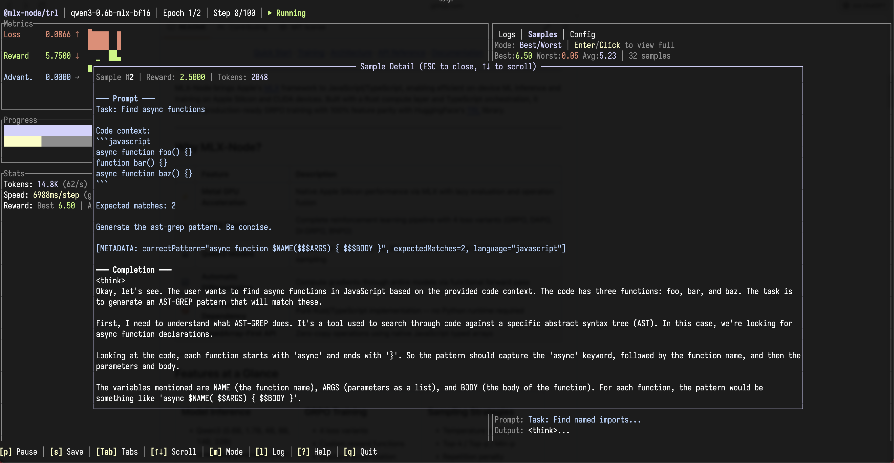

<div align="center">


<br>
<br>

**High-performance machine learning library for Node.js with GPU acceleration**

<br>

[](LICENSE)
[](https://nodejs.org/)
[](https://www.rust-lang.org/)

[Quick Start](#quick-start) · [Training](#grpo-training) · [Training TUI](#training-tui) · [Architecture](#architecture) · [API Reference](#api-reference) · [Documentation](#documentation)

</div>

---

MLX-Node brings Apple's [MLX](https://github.com/ml-explore/mlx) framework to JavaScript/TypeScript, enabling efficient on-device ML inference and training on Apple Silicon and CUDA devices. Built with a Rust compute layer and TypeScript orchestration, it delivers production-ready GRPO training with 100% feature parity with HuggingFace's [TRL](https://github.com/huggingface/trl) library.

<div align="center">

<br>
<em>Real-time training visualization with the built-in Ratatui TUI</em>
</div>

---

## Why MLX-Node?

| | Feature | Description |
|:--:|:--|:--|
| ⚡ | **Metal GPU Acceleration** | Native Apple Silicon performance via MLX with lazy evaluation and operation fusion |
| 🎯 | **GRPO Training** | Complete reinforcement learning pipeline with 4 loss variants (GRPO, DAPO, Dr.GRPO, BNPO) |
| 🤖 | **Qwen3 Models** | Support for 0.6B, 1.7B, 4B, 8B, 14B, 32B parameter models with advanced sampling |
| 🔄 | **Automatic Differentiation** | Compute gradients through entire models via functional forward pass |
| 🚫 | **Zero Python Dependency** | Pure Rust/TypeScript implementation — no Python runtime required |
| 📊 | **TypedArray-First API** | Zero-copy operations using native JavaScript typed arrays |

---

## Features at a Glance

<table>
<tr>
<td width="33%" valign="top">

### Model Inference
- Qwen3 (0.6B, 1.7B, 4B, 8B, 14B, 32B)
- Streaming generation [WIP]
- KV cache variants
- Chat templates

</td>
<td width="33%" valign="top">

### GRPO Training
- 4 loss variants
- Custom reward functions
- Gradient accumulation
- Checkpoint resumption

</td>
<td width="33%" valign="top">

### Sampling Strategies
- Temperature scaling
- Top-k / Top-p / Min-p
- Repetition penalty
- XTC sampling

</td>
</tr>
<tr>
<td width="33%" valign="top">

### Neural Network Layers
- Linear, Embedding
- RMSNorm, LayerNorm
- Attention (GQA)
- SwiGLU MLP

</td>
<td width="33%" valign="top">

### Optimizers
- Adam / AdamW
- SGD (with momentum)
- RMSprop
- LR schedulers

</td>
<td width="33%" valign="top">

### Advanced Features
- Autograd integration
- Entropy filtering
- Built-in rewards
- Batch generation

</td>
</tr>
</table>

---

## Quick Start

### Prerequisites

- macOS with Apple Silicon (M1/M2/M3/M4) with Metal (Linux with CUDA is coming soon)
- Node.js 18+
- Rust 1.90

### Build

```bash
git clone https://github.com/mlx-node/mlx-node.git
cd mlx-node
git submodule update --init --recursive
yarn install
yarn build
```

### Download and convert a Model

```bash
yarn download:qwen3
yarn oxnode ./scripts/convert-model.ts --input .cache/models/qwen3-0.6b -d bf16 --output .cache/models/qwen3-0.6b-mlx-bf16
```

### Test the converted model

```bash
yarn oxnode ./examples/test-converted-model.ts
```

### Generate Text

```typescript
import { Qwen3Model } from '@mlx-node/lm';

const model = await Qwen3Model.loadPretrained('.cache/models/qwen3-0.6b-mlx-bf16');

const result = await model.generate(
  [{ role: 'user', content: 'Write a haiku about TypeScript.' }],
  { maxNewTokens: 50, temperature: 0.8 }
);

console.log(result.text);
```

---

## GRPO Training

Train language models using Group Relative Policy Optimization:

```typescript
import { GRPOTrainer, loadLocalGsm8kDataset } from '@mlx-node/trl';

const trainer = await GRPOTrainer.create({
  modelPath: '.cache/models/qwen3-0.6b-mlx-bf16',
  outputDir: 'outputs/my-training',

  // Training hyperparameters
  learningRate: 5e-6,
  batchSize: 4,
  groupSize: 4,
  numEpochs: 3,

  // Generation
  maxNewTokens: 256,
  temperature: 0.8,
  repetitionPenalty: 1.1,

  // GRPO parameters
  clipEpsilon: 0.2,
  klCoef: 0.1,
  lossType: 'grpo',  // or 'dapo', 'dr_grpo', 'bnpo'

  // Custom reward function
  rewardFunction: async (prompts, completions, answers) => {
    return completions.map((completion, i) => {
      const expected = answers[i];
      if (!expected) return 0;
      return completion.includes(expected) ? 1.0 : 0.0;
    });
  },
});

const dataset = await loadLocalGsm8kDataset('.cache/gsm8k', 100);
await trainer.train(dataset);
```

### Built-in Reward Functions

```typescript
// Register multiple reward functions
trainer.registerBuiltinReward({
  rewardType: 'ToolUse',
  allowedTools: ['search', 'calculate'],
  weight: 1.0,
});

trainer.registerBuiltinReward({
  rewardType: 'XmlFormat',
  requiredTags: ['thinking', 'answer'],
  weight: 0.5,
});

trainer.registerBuiltinReward({
  rewardType: 'Length',
  minLength: 100,
  maxLength: 500,
});
```

### Loss Variants

| Variant | Description |
|:--|:--|
| `grpo` | Standard Group Relative Policy Optimization |
| `dapo` | Dynamic Advantage Policy Optimization — adaptive clipping |
| `dr_grpo` | Dropout-Regularized GRPO — improved stability |
| `bnpo` | Batch-Normalized Policy Optimization — normalized advantages |

### Training Examples

```bash
# Quick demo (15-20 minutes)
yarn oxnode examples/grpo/train-simple.ts

# Tool-use training with ast-grep
yarn oxnode examples/grpo/train-tool-use.ts
```

---

## Training TUI

MLX-Node includes a terminal user interface (TUI) built with [Ratatui](https://ratatui.rs/) for real-time training visualization and control.

<div align="center">

</div>

### Building the TUI

### Running Training with TUI

```bash
# Basic usage
cargo run -p mlx-tui -- --import '@oxc-node/core/register' --script ./examples/grpo/train-tool-use.ts
```

The TUI wraps your Node.js training script and communicates via stdout (JSONL messages) and stdin (control commands).

### TUI Features

| Panel | Description |
|:--|:--|
| **Header** | Model name, epoch/step progress, training status |
| **Metrics** | Loss, reward, and advantage with sparkline history |
| **Progress** | Epoch and step progress bars with percentages |
| **Stats** | Token count, elapsed time, step speed breakdown |
| **Logs** | Real-time training logs (scrollable) |
| **Samples** | Generated samples with rewards (best/worst/latest modes) |
| **Config** | Current training configuration |

### Keyboard Controls

| Key | Action |
|:--|:--|
| `p` | Pause training |
| `r` | Resume training |
| `s` | Save checkpoint |
| `Tab` | Switch between tabs (Logs/Samples/Config) |
| `↑` `↓` | Scroll within current tab |
| `m` | Cycle sample display mode (Best → Worst → Latest) |
| `?` | Toggle help overlay |
| `q` | Quit TUI |

### Enabling TUI Mode in Training Scripts

To make your training script compatible with the TUI, enable `tuiMode` in the trainer:

```typescript
import { GRPOTrainer } from '@mlx-node/trl';

const trainer = await GRPOTrainer.create({
  modelPath: '.cache/models/qwen3-0.6b-mlx-bf16',
  outputDir: 'outputs/training',
  tuiMode: true,  // Enable TUI-compatible output
  // ... other options
});
```

When `tuiMode` is enabled:
- All logging output uses JSONL format for TUI parsing
- The trainer listens for stdin commands (pause, resume, save)
- Progress updates are sent as structured messages

### TUI Message Protocol

The TUI communicates with training scripts via a simple protocol:

**Training → TUI** (stdout, JSONL):
```json
{"type": "step", "epoch": 1, "step": 10, "loss": 0.5, "reward": 4.2}
{"type": "log", "level": "info", "message": "Starting epoch 2"}
{"type": "sample", "prompt": "...", "completion": "...", "reward": 5.0}
```

**TUI → Training** (stdin, line commands):
```
pause
resume
save
```

---

## Architecture

MLX-Node uses a clean two-layer architecture: **Rust for compute**, **TypeScript for orchestration**.

```
┌──────────────────────────────────────────────────────────────────────────┐
│                     TypeScript Orchestration Layer                       │
│                          (2,528 lines)                                   │
│  ┌─────────────────┐  ┌─────────────────┐  ┌─────────────────┐           │
│  │  @mlx-node/lm   │  │  @mlx-node/trl  │  │ @mlx-node/core  │           │
│  │  Model loading  │  │  GRPO Trainer   │  │  (internal)     │           │
│  │  Generation     │  │  Rewards        │  │  NAPI bindings  │           │
│  │  Configs        │  │  Datasets       │  │  Type exports   │           │
│  └─────────────────┘  └─────────────────┘  └─────────────────┘           │
├──────────────────────────────────────────────────────────────────────────┤
│                       NAPI-RS Bridge (344 exports)                       │
├──────────────────────────────────────────────────────────────────────────┤
│                        Rust Compute Layer                                │
│                         (15,052+ lines)                                  │
│  ┌──────────────┐ ┌──────────────┐ ┌──────────────┐ ┌──────────────┐     │
│  │   array/     │ │ transformer/ │ │   grpo/      │ │  optimizers/ │     │
│  │  90+ ops     │ │  Attention   │ │  Loss        │ │  Adam(W)     │     │
│  │  Masking     │ │  KVCache     │ │  Advantages  │ │  SGD         │     │
│  │  Padding     │ │  MLP         │ │  Autograd    │ │  RMSprop     │     │
│  └──────────────┘ └──────────────┘ └──────────────┘ └──────────────┘     │
│  ┌──────────────┐ ┌──────────────┐ ┌──────────────┐ ┌──────────────┐     │
│  │   nn/        │ │ models/qwen3 │ │  sampling    │ │  tokenizer   │     │
│  │  Linear      │ │  Forward     │ │  Top-k/p     │ │  HuggingFace │     │
│  │  RMSNorm     │ │  Generation  │ │  Min-p, XTC  │ │  Chat        │     │
│  │  Embedding   │ │  Persistence │ │  Rep. Pen.   │ │  Templates   │     │
│  └──────────────┘ └──────────────┘ └──────────────┘ └──────────────┘     │
├──────────────────────────────────────────────────────────────────────────┤
│                     mlx-sys FFI + C++ Bridge                             │
│                       (683 + 3,732 lines)                                │
├──────────────────────────────────────────────────────────────────────────┤
│                  MLX Library + Metal GPU Backend                         │
│              Lazy evaluation · Operation fusion · GPU kernels            │
└──────────────────────────────────────────────────────────────────────────┘
```

### Package Overview

| Package | Purpose | Use For |
|:--|:--|:--|
| `@mlx-node/lm` | Model loading & inference | Loading models, generating text, model configs |
| `@mlx-node/trl` | Training & optimization | GRPO training, custom rewards, optimizers |
| `@mlx-node/core` | Native bindings (internal) | Low-level operations (usually import via lm/trl) |

### Import Patterns

```typescript
// For inference
import { Qwen3Model, Qwen3Tokenizer, QWEN3_CONFIGS, ModelLoader } from '@mlx-node/lm';

// For training
import {
  GRPOTrainer, GRPOConfig,
  Adam, AdamW, SGD, RMSprop,
  loadLocalGsm8kDataset,
  correctnessReward, strictFormatReward,
} from '@mlx-node/trl';

// For low-level operations (via trl re-exports)
import {
  MxArray, Linear, RMSNorm, Attention, TransformerBlock,
  KVCache, BatchKVCache, RotatingKVCache,
  Activations, Losses, Gradients,
} from '@mlx-node/trl';
```

---

## API Reference

### Model Loading & Generation

```typescript
import { Qwen3Model } from '@mlx-node/lm';

// Load a model
const model = await Qwen3Model.loadPretrained(modelPath);

// Generate with full sampling options
const result = await model.generate(messages, {
  maxNewTokens: 256,
  temperature: 0.8,
  topK: 50,
  topP: 0.95,
  minP: 0.05,
  repetitionPenalty: 1.1,
  xtcThreshold: 0.1,
  xtcProbability: 0.5,
});

console.log(result.text);
console.log(`Generated ${result.tokenCount} tokens`);

// Save fine-tuned model
await model.saveModel('outputs/fine-tuned');
```

### Sampling Strategies

| Strategy | Parameter | Description |
|:--|:--|:--|
| Temperature | `temperature: 0.8` | Controls randomness (lower = more focused) |
| Top-K | `topK: 50` | Keep top K most likely tokens |
| Top-P (Nucleus) | `topP: 0.95` | Cumulative probability threshold |
| Min-P | `minP: 0.05` | Minimum probability relative to max |
| Repetition Penalty | `repetitionPenalty: 1.2` | Reduce repetitive text |
| XTC | `xtcThreshold: 0.1` | eXclude Top Choices (stochastic) |

### Low-Level Operations

```typescript
import { MxArray, Linear, RMSNorm, Activations } from '@mlx-node/trl';

// Create arrays using TypedArrays
const x = MxArray.fromFloat32(
  new Float32Array([1, 2, 3, 4, 5, 6]),
  BigInt64Array.from([2n, 3n])  // shape: [2, 3]
);

// Matrix operations
const y = x.matmul(weights);
const sum = x.sum();
const mean = x.mean(0);  // Along axis 0

// Neural network layers
const linear = new Linear(512, 1024);
const norm = new RMSNorm(1024, 1e-5);

let h = linear.forward(input);
h = norm.forward(h);
h = Activations.silu(h);
```

### KV Cache Options

```typescript
import { KVCache, BatchKVCache, RotatingKVCache } from '@mlx-node/trl';

// Standard cache for single sequences
const cache = new KVCache();

// Batch cache for variable-length sequences with left-padding
const batchCache = new BatchKVCache([1, 2, 0]);  // Padding per sequence
const [keys, values] = batchCache.updateAndFetch(newKeys, newValues);
batchCache.filter([0, 2]);  // Keep only certain sequences

// Rotating cache for bounded memory
const rotatingCache = new RotatingKVCache({ maxSize: 2048, keep: 128 });
```

---

### Optimizations

- **Zero-copy TypedArray operations** — Direct memory access without serialization
- **Lazy evaluation** — Operations are traced and fused before execution
- **Fused kernels** — Combined attention, MLP, and transformer blocks in C++
- **Rust training loop** — Fast!
- **Thread-safe handles** — `Arc<MxHandle>` for safe multi-threaded access
- **Memory-efficient caching** — Standard, Batch, and Rotating KV cache options

---

## Development

```bash
# Build
yarn build              # Release build (native + TypeScript)
yarn build:debug        # Debug build
yarn build:native       # Native addon only
yarn build:ts           # TypeScript packages only

# Test
yarn test               # All tests (except trainers)
TEST_TRAINER=1 yarn test  # Include trainer tests (sequential)
yarn vitest run <path>  # Specific test file

# Quality
yarn typecheck          # TypeScript validation
yarn lint               # Linting with oxlint
```

### Project Structure

```
mlx-node/
├── crates/                     # Rust workspace
│   ├── mlx-sys/                # Low-level MLX bindings + C++ bridge
│   │   ├── src/lib.rs          # FFI bindings (683 lines)
│   │   └── src/mlx.cpp         # C++ bridge (3,732 lines)
│   └── mlx-core/               # All NAPI exports
│       └── src/
│           ├── array/          # Tensor operations
│           ├── nn/             # Neural network layers
│           ├── transformer/    # Attention, caches, blocks
│           ├── models/qwen3/   # Qwen3 implementation
│           ├── grpo/           # Training components
│           ├── optimizers/     # Adam, SGD, RMSprop
│           └── sampling.rs     # Generation strategies
├── packages/                   # npm workspace
│   ├── core/                   # @mlx-node/core (native addon)
│   ├── lm/                     # @mlx-node/lm (inference API)
│   └── trl/                    # @mlx-node/trl (training API)
├── examples/grpo/              # Training examples
└── __test__/                   # Test suite (20,211 lines)
```

---

## Project Status

| Phase | Status | Description |
|:--|:--|:--|
| Core Operations | ✅ Complete | 90+ array/tensor operations |
| Neural Networks | ✅ Complete | Layers, activations, losses |
| Gradients | ✅ Complete | Manual + automatic differentiation |
| Transformers | ✅ Complete | Attention, KVCache variants, MLP |
| GRPO Training | ✅ Complete | Production-ready with 4 loss variants |
| Autograd | ✅ Complete | Functional forward pass architecture |

**Test Coverage:** 1,036/1,039 tests passing (100%)

---

## Documentation

- [GRPO Training Guide](docs/grpo/README.md)
- [Autograd Integration](docs/AUTOGRAD_INTEGRATION.md)
- [Feature Alignment](docs/FEATURE_ALIGNMENT_SESSION.md)
- [Causal Mask Fix](docs/causal-mask-bug-fix.md)
- [Development History](docs/DEVELOPMENT_HISTORY.md)
- [SafeTensors Loader](docs/SAFETENSORS_LOADER.md)

---

## References

- [MLX Documentation](https://ml-explore.github.io/mlx/) — Apple's ML framework
- [GRPO Paper](https://arxiv.org/abs/2402.03300) — Group Relative Policy Optimization
- [TRL Library](https://github.com/huggingface/trl) — HuggingFace training library
- [Qwen3 Models](https://huggingface.co/Qwen) — Model weights
- [NAPI-RS](https://napi.rs/) — Rust Node.js bindings

---

## License

MIT License — see [LICENSE](LICENSE) for details.

---

## Acknowledgments

- [Apple MLX Team](https://github.com/ml-explore/mlx) for the ML framework
- [HuggingFace TRL](https://github.com/huggingface/trl) for GRPO reference implementation
- [NAPI-RS](https://napi.rs/) for seamless Node.js bindings
- [Qwen Team](https://huggingface.co/Qwen) for the model architecture

---

<div align="center">

**[Back to top](#mlx-node)**

</div>
