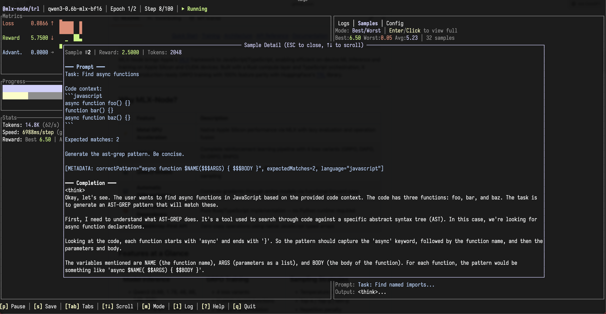

<div align="center">

</div>

# MLX-Node

[](https://www.npmjs.com/package/@mlx-node/cli)
[](LICENSE)

MLX-Node runs [MLX](https://github.com/ml-explore/mlx) models from Node.js. It includes language and multimodal inference, an HTTP server, model conversion, and GRPO/SFT training. The public APIs are TypeScript; the native layer is Rust and C++. Python is not required at runtime.

The main target is Apple Silicon with Metal. There is also an experimental CUDA backend for Linux on NVIDIA GB10 / DGX Spark.

## Install

The CLI requires Node.js 22.19 or newer. The published native binary requires macOS 26 or newer on Apple Silicon.

```bash
npm install --global @mlx-node/cli
mlx download model --model Qwen/Qwen3-0.6B
mlx serve --port 8080
```

Models downloaded by the CLI are stored in `~/.mlx-node/models` by default. Test the server with:

```bash
curl http://127.0.0.1:8080/v1/responses \
  -H 'content-type: application/json' \
  -d '{"model":"qwen3-0.6b","input":"Write a haiku about TypeScript."}'
```

The CLI also includes two ways to run a coding agent against a local model:

```bash
mlx agent
mlx launch claude
```

Run `mlx --help` for the full command list. See [docs/cli.md](docs/cli.md) for command options and model conversion examples.

## Library

Install the language-model package directly if you do not need the CLI:

```bash
npm install @mlx-node/lm
```

```typescript
import { homedir } from "node:os";
import { join } from "node:path";

import { loadSession } from "@mlx-node/lm";

const modelPath = join(homedir(), ".mlx-node", "models", "qwen3-0.6b");
const session = await loadSession(modelPath);

const first = await session.send("Write a haiku about TypeScript.");
console.log(first.text);

const followUp = await session.send("Make it shorter.");
console.log(followUp.text);
```

`ChatSession` owns the conversation and KV cache. The same API supports regular turns, streaming, tool results, and reset:

- `send()`
- `sendStream()`
- `sendToolResult()`
- `reset()`

See [docs/models.md](docs/models.md) for loading options and model-specific behavior.

## Models

Current model support includes:

- Qwen3 and Qwen3.5/3.6 Dense and MoE
- Gemma4
- LFM2 and LFM2.5
- Qwen3.5/3.6 VLM and Gemma4 VLM
- PaddleOCR-VL, Qianfan OCR, and the PP-StructureV3 document pipeline
- Qwen3-ASR
- Harrier embeddings

Qwen3 and Qwen3.5/3.6 Dense and MoE support GRPO and SFT training. Other model families are inference-only. The detailed support matrix is in [docs/models.md](docs/models.md).

## Server

`mlx serve` scans the models directory and loads a model when it is first requested. One model is resident at a time.

```bash
mlx serve
mlx serve --port 8080 --model qwen3-0.6b
mlx serve --host 0.0.0.0 --auth-token "$(openssl rand -hex 16)"
```

The server implements:

- `POST /v1/responses`
- `POST /v1/messages`
- `POST /v1/messages/count_tokens`
- `GET /v1/models`
- `GET /health` and `GET /v1/health`

Paged text models use continuous batching when the model supports it. Media turns and request-specific speculative decoding stay on ordered paths. The server also bounds admission and callback queues, propagates cancellation, and honors SSE backpressure. See [docs/concurrent-inference.md](docs/concurrent-inference.md) for the scheduler details.

## Training

The training package contains GRPO and SFT trainers. This is a small GRPO example using the GSM8K dataset downloaded by `mlx download dataset`:

```typescript
import { homedir } from "node:os";
import { join } from "node:path";

import { GRPOTrainer, loadLocalGsm8kDataset } from "@mlx-node/trl";

const trainer = await GRPOTrainer.create({
  modelPath: join(homedir(), ".mlx-node", "models", "qwen3-0.6b"),
  outputDir: "outputs/grpo",
  groupSize: 4,
  lossType: "grpo",
  rewardFunction: async (outputs) =>
    outputs.map(({ completion }) =>
      completion.text.includes("correct") ? 1 : 0,
    ),
});

const dataset = await loadLocalGsm8kDataset("train", { limit: 100 });
await trainer.train(dataset);
```

Available GRPO loss types are `grpo`, `dapo`, `dr_grpo`, and `bnpo`. Training supports custom and built-in rewards, gradient accumulation, checkpoint resume, and the Adam/AdamW, SGD, and RMSprop optimizers.

The repository also contains a Ratatui frontend for watching and controlling a training run:

```bash
cargo run -p mlx-tui -- \
  --import '@oxc-node/core/register' \
  --script ./examples/grpo/train-github-tool.ts
```

<div align="center">

</div>

See [docs/training.md](docs/training.md) for GRPO, SFT, datasets, checkpointing, and the TUI protocol.

## Platform support

| Platform                   | Backend | Status                              |
| -------------------------- | ------- | ----------------------------------- |
| macOS, Apple Silicon       | Metal   | Inference, training, and multimodal |
| Linux aarch64, NVIDIA GB10 | CUDA    | Experimental, inference only        |

The npm `darwin-arm64` binary has a macOS 26.0 deployment target. It does not load on macOS 15 or older. The binary contains NAX kernels for M5-class GPUs; MLX enables them on macOS 26.2 or newer. A local source build works on macOS 14 or newer and can set its deployment target with `MACOSX_DEPLOYMENT_TARGET`.

### CUDA preview

The CUDA path has been tested with Qwen3.6 27B Dense and 35B-A3B MoE on GB10 / DGX Spark (`sm_121`, CUDA 13.0). It currently uses eager fallbacks and has no mlx-node-specific CUDA kernels. Training, speculative decoding, x86_64 Linux, and prebuilt CUDA binaries are not supported.

Build it on an aarch64 glibc host with CUDA 13.0 and `nvcc` on `PATH`:

```bash
yarn install --immutable
yarn build:native
```

Paged attention is Metal-only, so CUDA inference must use the eager path:

```bash
MLX_QWEN35_FORCE_EAGER=1 MLX_QWEN35_PAGED_OVERRIDE=0 \
  oxnode examples/lm.ts Qwen3.6-27B-UD-Q4_K_XL-mlx
```

Measured results and the test setup are in [docs/cuda-poc-benchmark.md](docs/cuda-poc-benchmark.md).

## Build from source

The full workspace requires Node.js 22.19 or newer and Rust 1.89 or newer.

```bash
git clone --recurse-submodules https://github.com/mlx-node/mlx-node.git
cd mlx-node
yarn install --immutable
yarn build
```

Useful development commands:

```bash
yarn build:native
yarn build:ts
yarn test
yarn typecheck
yarn lint
```

Use `yarn build:native` to build the Node addon. A direct `cargo build` does not produce it. More development notes are in [CONTRIBUTING.md](CONTRIBUTING.md) and [docs/architecture.md](docs/architecture.md).

## Packages

- [`@mlx-node/lm`](packages/lm): model loading and chat sessions
- [`@mlx-node/server`](packages/server): HTTP inference server
- [`@mlx-node/agent`](packages/agent): local coding agent
- [`@mlx-node/trl`](packages/trl): GRPO and SFT training
- [`@mlx-node/vlm`](packages/vlm): vision-language models and document pipelines
- [`@mlx-node/asr`](packages/asr): speech recognition
- [`@mlx-node/privacy`](packages/privacy): local PII detection and redaction
- [`@mlx-node/cli`](packages/cli): CLI commands
- [`@mlx-node/core`](packages/core): internal native bindings

## Documentation

- [CLI](docs/cli.md)
- [Models and `ChatSession`](docs/models.md)
- [Inference architecture](docs/inference-architecture.md)
- [Concurrent inference](docs/concurrent-inference.md)
- [Paged KV cache](docs/paged-cache.md)
- [Training](docs/training.md)
- [Conversion and quantization](docs/convert-quantize.md)
- [Performance notes](docs/perf.md)
- [Desktop dashboard](docs/dashboard.md)
- [Privacy filter](docs/privacy-filter.md)

## License

[MIT](LICENSE)
