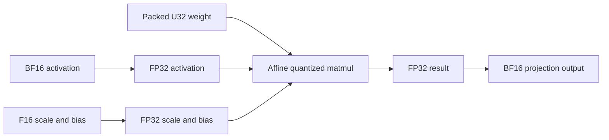

# Gemma 4 GGUF performance and dtype path audit

The Gemma slowdown has several concrete causes in the current execution path. The most directly measured is repeated widening of quantization **scales and biases**: a configuration gate prevents an existing load-time optimization from running. Enabling that optimization in an isolated config copy improved decode throughput by **12.0% across three paired comparisons**, with identical generated output. The packed projection weights remained unchanged throughout.

Attention introduces separate costs that grow with context. Sliding-window decode launches work over the full logical history before applying its window mask. Prefill gathers the full history and uses unfused score-matrix attention for the measured geometry and chunk size. Global decode also bypasses a faster grouped kernel at the tested context size. Selecting that existing kernel improved decode by **61.9% in two comparisons with reversed order**, using the same hoisted model and producing identical output. These findings explain why eliminating metadata casts alone cannot close the llama.cpp gap. [1–10]

The audit was performed on September 10, 2026 against the exact native addon used by the recorded-agent benchmark. Production runtime code, source weights, and the original prepared checkpoint were unchanged. Diagnostic config copies, experiment scripts, numeric evidence, and this report are the deliverables. Raw agent history remains in the ignored local benchmark directory.

## Benchmark and scope

The baseline uses `gemma-4-12b-it-qat-q4_0.gguf` on an M5 Max with 40 GPU cores and 128 GiB unified memory. It replays complete boundaries from a real mlx-node coding-agent session reviewing oxc-node PR #745. No repeated filler, invented tool result, or synthetic operator input enters these measurements. Each runtime receives the same Gemma input token IDs and produces 256 tokens with greedy decoding and high thinking. [1]

| Input tokens | MLX prefill tok/s | llama.cpp prefill tok/s | MLX decode tok/s | llama.cpp decode tok/s | MLX / llama.cpp request seconds |
| -----------: | ----------------: | ----------------------: | ---------------: | ---------------------: | ------------------------------: |
|        7,733 |            940.74 |                1,108.40 |            28.21 |                  43.74 |                   17.27 / 12.52 |
|       40,528 |            479.43 |                  702.36 |            16.15 |                  35.61 |                  100.35 / 64.87 |
|       66,904 |            380.35 |                  497.48 |            12.22 |                  28.40 |                 196.81 / 143.47 |

These are medians of three samples per cell. Both runtimes use BF16 KV, no speculation, no prompt-cache reuse, and 512-token physical prefill chunks. Loading and warmup are excluded. The workstation remains an interactive desktop; the observed ranges and all 18 samples are retained in the [original benchmark](../gemma4-agent-benchmark-2026-09-10/README.md).

The fixture is session `01a067cf-b782-7b58-855e-8158dcb283ab`, recorded September 3. The transcript lacks its original system prompt, so the Gemma benchmark reconstructs the wrapper using Pi 0.84.4 and current production message conversion. Its longest input contains 133 historical messages and 71 tool results. Historical and newly generated tool calls are never executed. The original session used Qwen; these are newly generated Gemma continuations, not a replay of Gemma's original answers.

Within each runtime, repeated outputs matched. Outputs differed between runtimes, and every request reached the 256-token cap, sometimes during reasoning. Throughput therefore does not establish answer-quality equivalence or completed-review latency. [1]

## Packed weights and floating-point conversions

The main GGUF contains 328 Q4_0 projections, one Q6_K embedding, and 338 F32 tensors. Q4_0 is a symmetric affine encoding with a 32-element group; it is distinct from Q4_K. The prepared text checkpoint stores the projection nibbles in U32 arrays and their original scales in F16 arrays. The importer records an implicit zero point of eight, and the common loader reconstructs the affine bias `-8 × scale` once at load. That redundant bias is omitted on disk but reappears in runtime memory because the generic affine matmul interface requires it. [2, 3]

| Text checkpoint component        | Arrays |  Stored bytes |
| -------------------------------- | -----: | ------------: |
| Packed Q4_0 projection weights   |    328 | 5,449,973,760 |
| F16 projection scales            |    328 |   681,246,720 |
| Packed Q6_K embedding companions |      3 |   825,753,600 |
| Small BF16 text arrays           |    337 |     1,539,680 |

The loader additionally derives 681,246,720 bytes of F16 projection biases. The media companion contains another 11 BF16 arrays totaling 104,759,808 bytes; these are separate from the text inventory and do not execute in the text-only replay. The header inspection and derived quantities are reproducible with [prepare.py](./prepare.py).

The active projection boundary is:



MLX's `quantized_matmul` promotes affine activations and floating-point companions to a common dtype. Its promotion table maps BF16 plus F16 to FP32. It consequently inserts activation, scale, and bias casts before the packed matmul. `Gemma4QuantizedLinear::forward_qmm` then restores the activation dtype on the output. This last cast protects the BF16 residual and paged-KV contracts; deleting it alone would let FP32 K/V reach a two-byte cache and fail validation. [3, 4]

This is **not a full-weight Q4 → BF16 → Q4 cycle**. The packed weight is an unchanged input to quantized matmul. Quantized Metal kernels decode the needed values inside their computation. The embedding gathers packed rows before dequantizing those rows, and its tied output head calls packed quantized matmul directly. The full 262,144 × 3,840 embedding table is not materialized as a dense BF16 head on every token. [4, 5]

There are other dequantization helpers in the repository, including legacy dense loading and the plain FP8 fallback. They are not this checkpoint's measured Q4_0 projection route. Likewise, FP32 accumulation inside a dot product, RMSNorm, or precise softmax is not evidence of a full tensor conversion. The unfused attention fallback uses a specialized last-axis softmax; its precise arithmetic should not be described as a separately materialized full FP32 probability matrix without a trace. [4, 7]

## The disabled cast-hoisting optimization

`parse_config_with_load_metadata` accepts BF16 only when `dtype` or its legacy spelling `torch_dtype` appears inside `text_config`. This prepared checkpoint instead declares `dtype: bfloat16` at the top level. Its nested text config has neither spelling. As a result, `text_config_explicitly_bfloat16` is false and `widen_bf16_affine_text_qmm_sidecars` returns immediately. [3]

The strict gate is intentional: a multimodal checkpoint can declare different dtypes for its text and media towers. The defect for this prepared GGUF is missing usable text-dtype metadata, so a production fix should establish the actual text dtype rather than assume every top-level BF16 declaration applies to every tower.

The existing optimization widens only eligible affine text projection scales and biases to FP32 during loading, evaluates them, and releases their old graph inputs. This preserves the current promoted-FP32 arithmetic exactly. It avoids rebuilding those companion casts on every forward call, while retaining the activation and output casts. It does not convert scales to BF16 or requantize weights.

The diagnostic changes exactly one config field: it adds `text_config.dtype = bfloat16`. All weights and tokenizer assets in both diagnostic directories are symlinks to the same prepared cache. The native addon is identical. Every measured request uses the saved 7,733-token real fixture, an empty prompt cache, 32-token excluded warmup, and 256 measured output tokens. Order alternates baseline/hoisted, hoisted/baseline, baseline/hoisted, with 20-second pauses. [2]

| Repetition | Baseline decode tok/s | Hoisted decode tok/s | Paired improvement |
| ---------: | --------------------: | -------------------: | -----------------: |
|          1 |                 31.95 |                35.22 |             10.25% |
|          2 |                 27.80 |                31.07 |             11.77% |
|          3 |                 31.72 |                36.20 |             14.13% |

The geometric mean of the paired decode ratios is **1.1204×**. The ratio of median throughputs is **1.1103×**, from 31.72 to 35.22 tok/s. All six outputs have SHA-256 `3dfac98afba9d24ce840e1c9eb7d70b5fc62348e592c095eb81e8f1925ccd0af`. Prefill varied substantially, so its increased median is not treated as an established optimization effect.

There is a memory tradeoff. The original scales plus biases occupy 1.269 GiB; widened companions occupy 2.538 GiB. Steady resident memory rises by approximately **1.269 GiB**, consistent with the recorded allocator measurements. Logs confirm 656 widened arrays covering 328 projections. The total logical read-plus-write volume of repeatedly converting those F16 companions to F32 is **4,087,480,320 bytes, or 3.807 GiB, per full forward** if each cast is materialized. This is an array-volume estimate, not a hardware DRAM counter: caching, scheduling, fusion, and allocation reuse affect physical traffic.

The baseline A/B rates differ from the earlier llama.cpp benchmark because this is a later experiment on an active desktop with profiling enabled. The defensible optimization claim is the contemporaneous paired comparison. It is not valid to compare 35.22 with an earlier llama.cpp median and declare a newly measured cross-runtime speed ratio.

llama.cpp's Q4_0 Metal decoder consumes the block's original F16 scale and derives the negative-eight offset locally. It does not first expand all scales and biases into standalone FP32 arrays. Its packed matmul can itself use FP32 activations, so FP32 activation arithmetic alone cannot explain the gap. In our MLX fork, FP32 also does not automatically disable M5 matrix acceleration: NAX dispatch permits it when TF32 is enabled, which is the default. [4, 6]

## Sliding-window decode does full-context work

This Gemma has 48 layers: 40 sliding-window layers with 16 query heads, eight KV heads, D256, and a 1,024-token window; and eight global layers with 16 query heads, one KV head, and D512. [2]

The paged sliding cache reclaims old physical blocks by replacing their logical entries with a reserved null block. It preserves absolute positions and the full recorded token count. `decode_attention_inputs` sends that full count as `seq_lens`, and the graph-native C++ dispatcher derives its partition count from the same value. Its kernel is compiled from the shared `paged_attention.metal` source. This trace matters because the Rust raw-Metal dispatcher is not the graph-native caller used by the model. [8]

The generic kernel determines its partition's block range from full context length. It loads K, computes QK, and only then masks tokens below `context_len - sliding_window`. Its V loop also walks that range. There is no early exclusion of partitions wholly before the live window. Physical memory reclamation therefore does not remove the logical scan or its threadgroups. The old entries can share a physical null block, so the scan must not be equated with reading a distinct full-history KV allocation from DRAM.

| Starting context | Generic partitions per head | Partitions intersecting a 1,024-token window |
| ---------------: | --------------------------: | -------------------------------------------: |
|            7,733 |                          16 |                                          2–3 |
|           40,528 |                          80 |                                          2–3 |
|           66,904 |                         131 |                                          2–3 |

At the longest boundary, 40 sliding layers × 16 query heads × 131 partitions gives **83,840 first-pass threadgroups per decoded token**, before the separate reduction pass. This is avoidable algorithmic work, not a measured 44–65× model speedup. A fix must preserve absolute RoPE positions, partial-block boundaries, causal masking, and correct empty-partition reduction values.

llama.cpp constructs a separate bounded SWA cache. For the single-sequence benchmark settings, its sizing formula yields 1,536 cells from the 1,024-token window plus the 512-token microbatch, rather than the full 73,728-token context allocation. Its Metal flash-attention implementation also has a precomputed masked-block skip. These are concrete implementation differences that favor bounded window work. [9]

The observed growth is consistent with an attention problem: MLX's baseline decode interval rises from about 35.4 ms/token to 81.8 ms/token across the tested contexts; llama.cpp rises from about 22.9 to 35.2 ms/token. Constant per-forward metadata casts cannot alone explain that widening difference. The exact time recoverable from compact sliding dispatch has not been measured in this audit.

## Prefill gathers and unfused attention

The sliding-window issue also reaches prefill, through a different path. `DenseCacheHitKv::gather_through_paged_pool` gathers `0..total_ctx` for a later chunk, including retired logical positions, and carries an explicit window mask into attention. Here “cache-hit prefill” includes chunks following the first chunk of a cold request; it does not establish cross-request prefix reuse. Runtime logs confirm the `paged_pool_sdpa` path for both sliding and global groups. [7, 8]

For the final full 512-token chunk at context 66,560, one sliding layer's gathered BF16 K and V contain 545,259,520 bytes. Its BF16 score tensor has shape equivalent to `[1,16,512,66560]`, containing another 1,090,519,040 bytes. These are individual logical array sizes, not a simultaneous peak-memory claim. A window-aware gather could bound this layer's relevant key range to at most the previous 1,024 tokens plus the current 512-token chunk.

Calling MLX's fast attention API does not guarantee a fused kernel. The pinned fork supports its D256 full causal kernel only for at least 1,024 query tokens, no explicit array mask, and supported device capability. The benchmark uses 512-token chunks. Once Gemma's local window is active, its explicit mask is an additional disqualifier. D512 global attention is unsupported by the fused full and vector kernels. The resulting fallback builds QK scores, applies a mask and softmax, and multiplies by V. [7]

Increasing the chunk size alone is therefore insufficient: it does not remove the sliding mask restriction, compact the gather, or add D512 fused attention. The useful work is a bounded sliding prefill path plus a fused kernel that represents the actual window semantics, followed by separate D512 prefill optimization.

## Global decode route screening

The automatic decode policy admits gathered SDPA only for 16 query heads, **two** KV heads, D512, and its measured context/memory conditions. This checkpoint has **one** KV head, so it falls back with `unsupported_geometry`. The separate grouped-D512 model policy crosses over at a 92 Ki-token context bucket, beyond all three benchmark boundaries. Both measured layer geometries therefore take generic paged decode by default. [10]

The sliding-layer log reason `unsupported_dtype` is easy to misread. Its source is `prefill_sdpa_cache_dtype()` returning `None` to block the window-blind dense decode gather. It does not mean those KV arrays unexpectedly became FP32. Forcing SDPA preserves that guard and changes only the eligible global layer path.

The [numeric results](./results.json) include a separate 66,904-token route experiment with hoisted companions. Every sample uses the same real input, binary, weights, BF16 KV, 256 output tokens, and cold cache. The first block ran auto, gathered SDPA, then grouped D512; a later block reversed the auto/grouped order. Logs confirm that the grouped kernel was selected for the eight global layers while sliding layers retained generic paged attention. [2, 10]

| Route                                        | Decode tok/s, first / repeat | Prefill tok/s, first / repeat | Request seconds, first / repeat |
| -------------------------------------------- | ---------------------------: | ----------------------------: | ------------------------------: |
| Default auto                                 |                13.45 / 13.38 |               407.84 / 418.49 |                 183.03 / 178.95 |
| Grouped D512 forced                          |                21.79 / 21.65 |               405.50 / 416.71 |                 176.73 / 172.36 |
| Gathered SDPA forced, one exploratory sample |                    20.01 / — |                    399.96 / — |                      180.05 / — |

The two grouped/auto decode ratios are 1.6196× and 1.6176×, giving a geometric mean of **1.6186×**. All five output hashes match: `0670bf154206f3c3df1fc7542d391835d5633727fc093b66e914a6398045e40a`. The nearly unchanged prefill rate is expected because only decode routing changed. Request time falls about **3.4% and 3.7%**, much less than the decode gain, because prefill takes most of the capped request's time.

This establishes a substantial route opportunity at this model/context/hardware point. It does not establish a universal crossover from two repetitions, especially at smaller contexts or tighter memory limits. The single gathered-SDPA result is exploratory. These comparisons already have companion casts hoisted; their gains must not be added to the short-fixture cast percentage or treated as a new matched comparison with the earlier llama.cpp samples.

An attempted warm-prefix shortcut reported zero cached tokens and was stopped by its validation guard. That request is excluded from the reported route statistics. Host profiling is retained but does not assign GPU duration to individual operators: asynchronous submission and execution cross the reported phase boundaries. No hardware-counter or per-operator GPU trace was collected.

## Why Qwen's result differs

[Issue #142](https://github.com/mlx-node/mlx-node/issues/142) reports Qwen prefill advantages of 26.8–56.9%; decode wins are 5.1% and 13.8% at the shorter contexts and effectively a tie at 32k. It is not a universal claim that every Qwen or every context wins. [11]

The current prepared Qwen3.8 27B config uses the Qwen3.5 architecture: 48 linear-attention layers and 16 full-attention layers, the latter with 24 query heads, four KV heads, and D256. Its checkpoint overrides include 191 Q5_K, 69 Q4_K, 56 Q6_K, 80 other K/IQ modes, and 110 affine entries. All affine entries are eight-bit. These are checkpoint configuration counts, including entries not executed when speculation is disabled, not a per-token kernel count. [2]

K/IQ quantized matmul retains the activation dtype and consumes its encoded companions in their stored types. The affine mixed-floating promotion examined above does not apply to those large K-quant matrices. Qwen is not completely free of affine projections, but it does not put all its large decoder projections through Gemma's Q4_0 affine representation. The shared `Q4` filename shorthand conceals materially different storage and kernels. [4]

Qwen's D256 full-attention geometry also matches the existing grouped decode kernel, enabled at 16,384 tokens for its 24/4 head layout. The 18,754- and 32,488-token issue rows qualify. Its 2,048-token prefill chunks can qualify for the fused causal D256 kernel already present in the same pinned MLX library; Gemma's measured prefill path cannot. Its linear-attention layers avoid this Gemma sliding-cache scan entirely. These are source-grounded explanations for the different behavior, not an isolated measurement of each factor. [7, 10]

| Protocol dimension     | Qwen issue #142         | Gemma benchmark                     |
| ---------------------- | ----------------------- | ----------------------------------- |
| Input lengths          | 6,219 / 18,754 / 32,488 | 7,733 / 40,528 / 66,904             |
| Output cap             | 512                     | 256                                 |
| Physical prefill chunk | 2,048                   | 512                                 |
| MLX / llama.cpp KV     | BF16 / F16              | BF16 / BF16                         |
| llama.cpp CPU threads  | 8                       | 6                                   |
| Pause between samples  | 60 seconds              | 20 seconds                          |
| Native mlx-node base   | `c14e5584`              | `185bc1b0` plus native-GGUF changes |

The history wrappers also differ: the Qwen issue used a review wrapper and final continuation instruction, while the Gemma replay includes current production tools and chat formatting. Cross-model rates cannot isolate backend quality. The later Qwen early-Metal-submission change must not be credited for issue #142: that benchmark's commit predates it, and its paged forward source lacks the new early-evaluation path. [1, 11]

## Recommended implementation order

1. **Correct effective text dtype resolution for the load-time hoist.** Prefer writing an explicit text dtype when preparing this known BF16 GGUF, or resolve the effective text dtype with evidence in the loader. Honor nested overrides and preserve the mixed-tower protection; do not blindly inherit every multimodal top-level dtype. Preserve format, packed-storage, and projection-family guards. Add regression coverage for this actual top-level-BF16/nested-missing shape, nested overrides, legacy spelling, and non-affine companions. This is the smallest measured opportunity, with an explicit 1.269 GiB memory cost.
2. **Calibrate global D512 decode for 16/1 heads.** Repeat the route screen in alternating order across the actual context sizes and memory budgets. Add the geometry to automatic routing only where measured behavior and numerical checks justify it. Preserve the sliding gather refusal and low-memory fallback.
3. **Compact sliding-window decode and prefill.** Exclude old logical partitions before K/V loads and bound dense gathers to the live suffix plus current chunk. Retain absolute position metadata separately. Validate partial blocks, retired sentinel entries, cache restore, rollback, and ragged batches against the existing windowed reference. Mask removal is not a valid optimization.
4. **Introduce a mixed-dtype symmetric Q4_0 matmul path.** Accept BF16 activations and original F16 scales, derive the zero-point offset inside the kernel, accumulate with the required precision, and return the intended activation dtype. This can eliminate recurring activation/output materializations and resident expanded biases. It requires operator parity and model-level validation; converting F16 scales to BF16 would round checkpoint values and is not an equivalent shortcut.
5. **Extend fused attention for Gemma's real shapes.** Prioritize explicit sliding-window D256 prefill and D512 global prefill after fixing the full-history gather. Measure TTFT and request latency, not just standalone kernel throughput.

No source patch implementing these recommendations is included in the audit. The load-time config experiment preserves current arithmetic; proposed new mixed-dtype kernels and attention implementations can change reduction order and need stronger numerical checks than a single matching continuation hash.

## Reproduction and evidence

The local fixture and existing prepared checkpoint are required. Preserve the saved `inputs.json`: recreating a system wrapper on another day can change its date or tool definitions. From the repository root:

```sh
python3 docs/research/gemma4-path-audit-2026-09-10/prepare.py /path/to/existing/prepared/cache
oxnode docs/research/gemma4-path-audit-2026-09-10/probe.ts pairs unused diff-review
MLX_AGENT_METRICS=0 MLX_PERSIST_PAGED_CACHE=0 MLX_PAGED_PREFILL_CHUNK_SIZE=512 MLX_NODE_LOG=info MLX_GEMMA4_PAGED_DECODE_ROUTE=auto MLX_PAGED_GROUPED_D512=auto oxnode docs/research/gemma4-path-audit-2026-09-10/probe.ts worker hoisted final-review auto-long
oxnode docs/research/gemma4-path-audit-2026-09-10/probe.ts routes
oxnode docs/research/gemma4-path-audit-2026-09-10/probe.ts reverse-routes
python3 docs/research/gemma4-path-audit-2026-09-10/summarize.py
```

Run with other diagnostic MLX overrides unset. The data directory is `.cache/benchmarks/gemma4-path-audit-2026-09-10/`. The public results contain numeric samples, hashes, inventory, and limitations; they do not contain transcript or generated text. `prepare.py` refuses to replace existing nonmatching diagnostic assets.

Version anchors are mlx-node `185bc1b0a19e70e3a522452d4cbe69f2f24b47a9`, the native-GGUF worktree patch with SHA-256 `ad04eeb7ea9564f8fb4bf06bad28d5c86a0d06bd2bd6765630cd70974adc412e`, MLX fork `6d45ab90cfec5e7fe0cfe25bc635a23ac8a351bb`, and llama.cpp `a14dba686aaafba3a2d6b5eb8820b0df5c5d2d92`. The native addon SHA-256 is `152c04e75260d2d86d584d861508cda567150d2c5515343ff61fc187672660e2`. These are pinned local revisions, not claims about newest upstream behavior.

## Sources

All implementation sources below were read from the corresponding local pinned checkouts. Function names identify the relevant logic where the task's existing native-GGUF patch shifts line numbers. Numeric evidence was collected September 10, 2026 unless otherwise stated.

1. mlx-node, [recorded-agent Gemma benchmark](../gemma4-agent-benchmark-2026-09-10/README.md) and [all 18 baseline samples](../gemma4-agent-benchmark-2026-09-10/results.json). Fixture provenance, protocol, original runtime comparison, and output limitations.
2. mlx-node, [audit numeric evidence](./results.json), [header/config inspection](./prepare.py), and [same-binary probe](./probe.ts). Private source session and checkpoint are accessible locally; only numeric evidence and hashes are exported.
3. mlx-node, [Gemma persistence](https://github.com/mlx-node/mlx-node/blob/185bc1b0a19e70e3a522452d4cbe69f2f24b47a9/crates/mlx-core/src/models/gemma4/persistence.rs), `parse_config_with_load_metadata` and `widen_bf16_affine_text_qmm_sidecars`; [common persistence](https://github.com/mlx-node/mlx-node/blob/185bc1b0a19e70e3a522452d4cbe69f2f24b47a9/crates/mlx-core/src/engine/persistence.rs#L223), `expand_symmetric_affine_biases`; [GGUF affine loading](https://github.com/mlx-node/mlx-node/blob/185bc1b0a19e70e3a522452d4cbe69f2f24b47a9/crates/mlx-core/src/utils/gguf.rs), `load_quantized_tensor`.
4. MLX fork, [quantized matmul dtype/input construction](https://github.com/mlx-node/mlx/blob/6d45ab90cfec5e7fe0cfe25bc635a23ac8a351bb/mlx/ops.cpp#L4799), [promotion table](https://github.com/mlx-node/mlx/blob/6d45ab90cfec5e7fe0cfe25bc635a23ac8a351bb/mlx/dtype.cpp#L35), and [NAX eligibility](https://github.com/mlx-node/mlx/blob/6d45ab90cfec5e7fe0cfe25bc635a23ac8a351bb/mlx/backend/metal/quantized.cpp#L950); mlx-node, [Gemma quantized projection boundary](https://github.com/mlx-node/mlx-node/blob/185bc1b0a19e70e3a522452d4cbe69f2f24b47a9/crates/mlx-core/src/models/gemma4/quantized_linear.rs#L788).
5. mlx-node, [packed embedding lookup and tied head](https://github.com/mlx-node/mlx-node/blob/185bc1b0a19e70e3a522452d4cbe69f2f24b47a9/crates/mlx-core/src/nn/embedding.rs#L123), `forward` and `as_linear`; [Gemma head caller](https://github.com/mlx-node/mlx-node/blob/185bc1b0a19e70e3a522452d4cbe69f2f24b47a9/crates/mlx-core/src/models/gemma4/model/forward.rs#L431).
6. llama.cpp, [Q4_0 Metal decoding](https://github.com/ggml-org/llama.cpp/blob/a14dba686aaafba3a2d6b5eb8820b0df5c5d2d92/ggml/src/ggml-metal/ggml-metal.metal#L207) and [packed matmul dispatch](https://github.com/ggml-org/llama.cpp/blob/a14dba686aaafba3a2d6b5eb8820b0df5c5d2d92/ggml/src/ggml-metal/ggml-metal-ops.cpp#L2300).
7. MLX fork, [actual fused-attention eligibility](https://github.com/mlx-node/mlx/blob/6d45ab90cfec5e7fe0cfe25bc635a23ac8a351bb/mlx/backend/metal/scaled_dot_product_attention.cpp#L670), [unfused attention graph](https://github.com/mlx-node/mlx/blob/6d45ab90cfec5e7fe0cfe25bc635a23ac8a351bb/mlx/fast.cpp#L717), and [softmax dispatch](https://github.com/mlx-node/mlx/blob/6d45ab90cfec5e7fe0cfe25bc635a23ac8a351bb/mlx/ops.cpp#L3994); mlx-node, [dense cache-hit gather and window mask](https://github.com/mlx-node/mlx-node/blob/185bc1b0a19e70e3a522452d4cbe69f2f24b47a9/crates/mlx-core/src/models/gemma4/attention/dense_cache_hit.rs#L132).
8. mlx-node, [adapter pruning](https://github.com/mlx-node/mlx-node/blob/185bc1b0a19e70e3a522452d4cbe69f2f24b47a9/crates/mlx-core/src/transformer/paged_kv_cache_adapter.rs#L4164), [decode metadata](https://github.com/mlx-node/mlx-node/blob/185bc1b0a19e70e3a522452d4cbe69f2f24b47a9/crates/mlx-core/src/transformer/paged_kv_cache_adapter.rs#L5333), [graph-native partition allocation](https://github.com/mlx-node/mlx-node/blob/185bc1b0a19e70e3a522452d4cbe69f2f24b47a9/crates/mlx-sys/src/mlx_paged_dispatch.cpp#L1185), and [shared kernel block ranges, loads, and late mask](https://github.com/mlx-node/mlx-node/blob/185bc1b0a19e70e3a522452d4cbe69f2f24b47a9/crates/mlx-paged-attn/metal/attention/paged_attention.metal#L805).
9. llama.cpp, [separate SWA cache sizing](https://github.com/ggml-org/llama.cpp/blob/a14dba686aaafba3a2d6b5eb8820b0df5c5d2d92/src/llama-kv-cache-iswa.cpp#L69) and [masked-block skip in Metal attention](https://github.com/ggml-org/llama.cpp/blob/a14dba686aaafba3a2d6b5eb8820b0df5c5d2d92/ggml/src/ggml-metal/ggml-metal.metal#L6730).
10. mlx-node, [Gemma decode policy and geometry gates](https://github.com/mlx-node/mlx-node/blob/185bc1b0a19e70e3a522452d4cbe69f2f24b47a9/crates/mlx-core/src/models/gemma4/attention.rs#L215), `grouped_d512_measured_crossover`, `select_paged_decode_plan`, and `forward_paged_single_token_attention`; [Qwen grouped decode eligibility](https://github.com/mlx-node/mlx-node/blob/185bc1b0a19e70e3a522452d4cbe69f2f24b47a9/crates/mlx-sys/src/mlx_paged_dispatch.cpp#L489).
11. mlx-node, [issue #142](https://github.com/mlx-node/mlx-node/issues/142), initial Qwen3.8 27B UD-Q4_K_XL measurement dated September 9, 2026; its locally retained `publish/benchmark-metadata.json` and prepared checkpoint config. Prior source at [`c14e5584`](https://github.com/mlx-node/mlx-node/tree/c14e55847c8fa44dbb7a965b1f47af7c1d819826) was checked separately from the current worktree.
