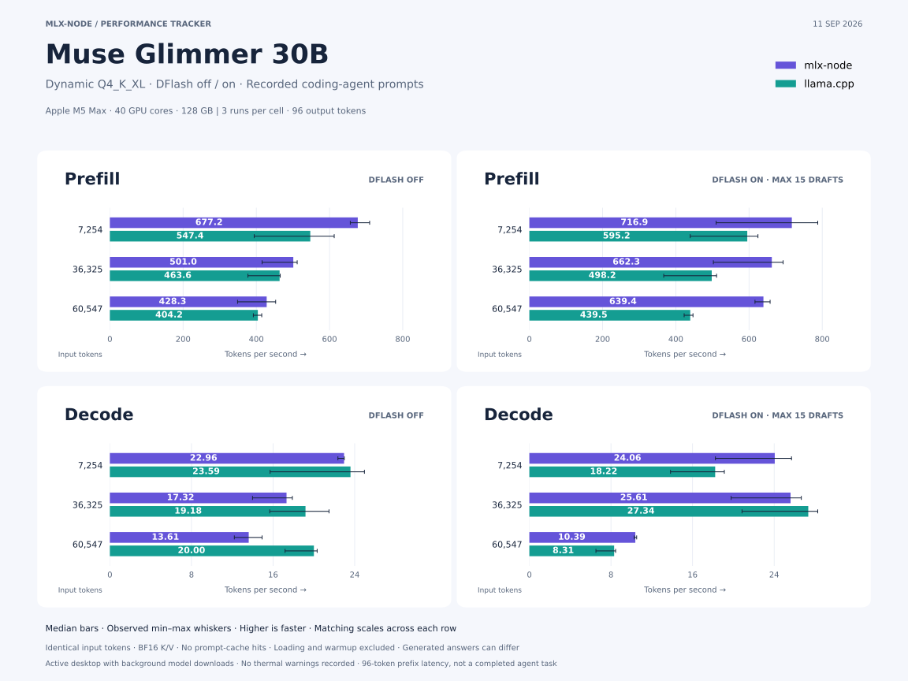

# Muse Glimmer Q4_K_XL: mlx-node versus llama.cpp

September 11, 2026. Completed **36 accepted measurements**: three real review histories × two runtimes × DFlash off/on × three repetitions. These tables and the chart describe the original implementation. The later [compact-read A/B](#decode-optimization-compact-sliding-reads) adds eight samples and improves measured AR decode by 15.7% at 36k and 17.8% at 60k context.

**Observed medians:** mlx-node processed prompts faster in all six matched comparisons, and mlx-node with DFlash had the lowest request time at all three lengths. llama.cpp had faster AR decode at every length. DFlash slowed decode on the longest continuation in both runtimes. The ranges below capture substantial variability on this active desktop; these are not peak-performance claims.



## Decode, tokens/second

Each cell is **median [minimum–maximum]** across three fresh processes.

| Input tokens |                MLX, off |          llama.cpp, off |             MLX, DFlash |       llama.cpp, DFlash |
| -----------: | ----------------------: | ----------------------: | ----------------------: | ----------------------: |
|        7,254 | **22.96** [22.36–22.98] | **23.59** [15.71–24.96] | **24.06** [18.24–25.70] | **18.22** [13.84–19.11] |
|       36,325 | **17.32** [13.98–17.89] | **19.18** [15.67–21.48] | **25.61** [19.78–26.66] | **27.34** [20.85–28.27] |
|       60,547 | **13.61** [12.20–14.92] | **20.00** [17.18–20.32] | **10.39** [10.28–10.52] |    **8.31** [6.53–8.46] |

## Prefill, tokens/second

Each cell is **median [minimum–maximum]** across three fresh processes.

| Input tokens |                MLX, off |          llama.cpp, off |             MLX, DFlash |       llama.cpp, DFlash |
| -----------: | ----------------------: | ----------------------: | ----------------------: | ----------------------: |
|        7,254 | **677.2** [656.7–709.6] | **547.4** [394.4–612.8] | **716.9** [510.1–787.7] | **595.2** [439.4–624.4] |
|       36,325 | **501.0** [415.8–511.7] | **463.6** [377.1–465.3] | **662.3** [502.6–693.1] | **498.2** [367.0–511.4] |
|       60,547 | **428.3** [348.8–452.9] | **404.2** [391.9–414.8] | **639.4** [616.3–657.6] | **439.5** [422.8–447.0] |

## Request time, seconds

Each cell is **median [minimum–maximum]** across three fresh processes.

| Input tokens |                   MLX, off |             llama.cpp, off |                MLX, DFlash |          llama.cpp, DFlash |
| -----------: | -------------------------: | -------------------------: | -------------------------: | -------------------------: |
|        7,254 |    **14.85** [14.37–15.30] |    **17.28** [15.65–24.44] |    **14.08** [12.92–19.44] |    **17.40** [16.59–23.38] |
|       36,325 |    **77.85** [76.52–94.19] |   **83.31** [82.49–102.38] |    **58.59** [56.00–77.11] |   **76.40** [74.40–103.53] |
|       60,547 | **148.38** [140.11–181.42] | **154.56** [150.64–160.04] | **103.78** [101.37–107.45] | **149.22** [146.70–157.78] |

## DFlash effect

| Input tokens | MLX decode change | llama.cpp decode change | MLX request change | llama.cpp request change |
| -----------: | ----------------: | ----------------------: | -----------------: | -----------------------: |
|        7,254 |             +4.8% |                  -22.8% |              -5.2% |                    +0.7% |
|       36,325 |            +47.9% |                  +42.6% |             -24.7% |                    -8.3% |
|       60,547 |            -23.7% |                  -58.4% |             -30.1% |                    -3.5% |

Positive decode change means faster generation; negative request change means less total time. These ratios compare medians, not paired statistical estimates. Host variability is substantial; do not use this run to set fixed CI speed thresholds.

All 36 requests generated exactly 96 tokens, had zero cached prompt tokens, and passed the thermal/performance-warning checks. Every speculative sample recorded actual drafting and accepted drafts. These checks do not establish thermal stability or a quiet machine.

Output stability across the three repeats and both modes:

| History      | MLX identical text across all six runs | llama.cpp identical text across all six runs |
| ------------ | -------------------------------------- | -------------------------------------------- |
| diff-review  | no                                     | yes                                          |
| test-review  | yes                                    | yes                                          |
| final-review | no                                     | yes                                          |

Within each of the 12 runtime/mode/context combinations, all three repeats produced identical text. Timing variation within a cell therefore does not come from changed output text. The table above additionally compares across speculation modes.

Median accepted/drafted token ratio, from each runtime's native counters:

| Input tokens | MLX DFlash | llama.cpp DFlash |
| -----------: | ---------: | ---------------: |
|        7,254 |      21.8% |            23.2% |
|       36,325 |      38.6% |            48.0% |
|       60,547 |      13.7% |            11.0% |

## Workload and protocol

Measured September 11, 2026 on an Apple M5 Max, 40 GPU cores, 128 GB, macOS 26.6.2, AC power. This is a single active desktop, with two background model downloads and desktop/monitoring activity. No competing inference or compilation was observed. Record the observed ranges; these are not idle-machine ceilings or confidence intervals.

The target is `Muse-Glimmer-30B-KQuant-Dynamic-Q4_K_XL.gguf` (19,653,960,832 bytes). Its 418 packed target tensors comprise 51 Q4_K, 130 Q5_K, and 237 Q6_K tensors; the preset name does not mean every weight is four-bit. The shared companion is `dflash-kquant.gguf` (1,631,205,312 bytes): a five-layer DFlash model, not a DSpark checkpoint. Both engines use this same companion. DFlash's 16-position block contains an anchor plus 15 proposed tokens; the benchmark fixes both engines to a maximum of 15 proposals, disables MLX adaptive depth/fallback, and leaves llama.cpp's CPU thread count automatic. Final blocks may shrink to respect the remaining output budget. This is a matched fixed-width comparison, not a search for an optimal draft width.

The unchanged public [`gemma4-oxc-review-v1`](../../scripts/fixtures/gemma4-oxc-review-v1.json) histories come from real mlx-node session `01a067cf-b782-7b58-855e-8158dcb283ab`, reviewing Oxc-node PR #745. Its original system prompt was absent; the previous Gemma study reconstructed and froze a Pi 0.84.4 wrapper. This benchmark reuses those exact frozen messages/tools and renders them with Muse's template/tokenizer. The resulting input lengths are **7,254 / 36,325 / 60,547**. All three llama.cpp tokenizations are checked against the exact Muse input IDs. Recorded tool calls remain data and are never executed.

Each of the 12 runtime/mode/context combinations has three measured fresh-process repetitions. Every process warms up for 32 tokens on the shortest history, resets prompt state, then measures exactly 96 generated tokens. A 256-token pilot naturally ended at 115 tokens on the shortest history, so a 96-token prefix gives equal output counts without padding inputs or suppressing EOS. Pilots and failed harness attempts are excluded. No measured request may contain prefix-cache hits, truncated input, or fewer than 96 output tokens. Runtimes/modes alternate in forward/reverse order with 20-second cooldowns; all inference runs serially.

MLX uses the production LM `ChatSession` with owner-scoped cache lifecycle. A raw-core, ownerless AR pilot failed sliding-cache admission before measurement; switching the harness to the production session path resolved it without changing the model runtime. MLX AR uses its paged cache; DFlash uses the current default flat speculative path. MLX preserves BF16 target/draft activations and KV, with original FP16 quantization sidecars retained. llama.cpp uses Metal, all GPU layers, flash attention, BF16 target/draft KV, a 61,440-token context, one slot, logical batch 2,048, physical batch 512, and no context shifting. MLX's physical prefill chunk is also 512. Sampling is greedy, high thinking, with repetition/frequency/presence penalties disabled.

One original long-context llama.cpp AR sample overlapped a one-second process-stack diagnostic after an unusually slow model load. Its JSON/logs are retained under `diagnostics/` and excluded from the tables. That cell was repeated after the matrix with unchanged settings and no diagnostic sampling; the reported 36 samples include the replacement. Exclusion was based on observer overlap, not its speed or output.

Loading and warmup are excluded. Prefill measures through the first generated token; decode covers the subsequent **95** tokens in both runtimes. Request wall time is also recorded, including the respective LM wrapper or local HTTP overhead. This measures a capped continuation, not a completed review, executed tool round trip, or end-to-end agent task. Greedy outputs may differ because of numerical and execution-path differences; throughput does not establish quality parity or lossless speculation.

## Decode optimization: compact sliding reads

The original AR gap grows with context: **43.55 vs 42.39 ms/token** at 7,254 input tokens and **73.46 vs 49.99 ms/token** at 60,547. Source inspection found unnecessary attention work in the production scheduler path, separate from weight quantization.

Muse has 39 sliding-window layers (2,048 tokens) and 13 global layers. Owner-scoped AR uses `run_paged_decode_step_batched` → `forward_paged_batched` → `gather_kv_for_decode_graph_batched`. The old `build_batched_attention_inputs` discarded the compact metadata from `decode_attention_inputs` and rebuilt the full logical block table and absolute sequence length, including for a batch of one. The generic Metal kernel loaded keys and computed QK before masking expired positions.

The adapter now preserves compact reads for singleton decode and builds compact metadata for multiple owners and ragged queries. Each owner's first query determines the oldest required key; later verifier queries cannot shorten that first query's window. Only read metadata is rebased. Cache writes, allocation, retention, RoPE positions, and rollback retain their absolute positions. The policy follows the admitted window, block size, and query span, with no chip-specific constants or tuning override.

At the first 60,547-token continuation step, each sliding layer needs **5 rather than 119** generic 512-token partitions. Across 52 layers, first-stage workgroups fall from 198,016 to 55,744 (**71.8%**). This is a dispatch-count reduction, not a token-latency or DRAM-bandwidth prediction: retired pages can alias one null block, and projections/global attention still run.

The references implement the same bounded-work principle:

- llama.cpp `a14dba686aaafba3a2d6b5eb8820b0df5c5d2d92`: `src/llama-kv-cache-iswa.cpp` sizes a separate SWA cache from the window plus physical batch; `src/llama-graph.cpp` selects it for Muse sliding layers.
- vLLM `a9271c750f6eb07ad7e4c52b9dffa65ff2ee336a`: `compute_tile_loop_bounds` in `vllm/v1/attention/ops/triton_attention_helpers.py` bounds the allowed KV tiles before `triton_unified_attention.py` enters the loop. Retention for speculative rollback remains a separate concern. Its [hybrid cache design](https://docs.vllm.ai/en/latest/design/hybrid_kv_cache_manager/) also distinguishes sliding and full-attention requirements. This is an algorithmic reference, not an Apple GPU performance comparison.

A separate eight-sample A/B experiment uses the unchanged real fixture and benchmark worker, 32 warmup tokens, 96 measured output tokens, zero prompt-cache hits, serial fresh processes, and 20-second cooldowns. Long-context order is baseline/compact/compact/baseline; shorter contexts have one pair each. No build or profiler overlaps the measured jobs.

| Input tokens | Samples per variant | Baseline decode tok/s | Compact decode tok/s | Change | Same greedy output? |
| -----------: | ------------------: | --------------------: | -------------------: | -----: | :------------------ |
|        7,254 |                   1 |                 22.81 |                22.82 |    ~0% | No                  |
|       36,325 |                   1 |                 17.31 |                20.02 | +15.7% | Yes                 |
|       60,547 |                   2 |                 13.84 |                16.30 | +17.8% | No                  |

Long-context ranges are 13.79–13.89 baseline and 15.41–17.18 compact. Both long-context repeats reproduce their own variant's text. Changed partition boundaries alter floating-point reduction order; exact output parity is not claimed. The independent numerical regression checks BF16 output against FP64 softmax with nonuniform Q/K/V, head size 128, 32 Q/2 KV heads, 513/2,048-token windows, partial pages, and one/17 query rows (absolute error below 0.003). It passes; the throughput samples still do not establish model-quality equivalence. The original llama.cpp long-context median was 20.00 tok/s in the earlier matrix, so this does not close the measured gap or demonstrate a hardware ceiling.

Prefill medians for these pairs are 687.9/647.8, 491.9/505.4, and 395.9/373.0 tok/s (baseline/compact). This change targets decode metadata; the small, active-desktop experiment is insufficient to assign the prefill variation to it. Short and middle contexts have only one pair and provide no repeatability estimate.

Focused release validation passed **479 tests**, with 16 explicitly ignored: 155 adapter tests, 225 Muse tests, 48 scheduler tests, the new BF16 numerical regression, and 50 Gemma attention/cache/speculation regressions. The optimized native build succeeds. Full repository tests and remote CI were not run.

Local evidence: `.cache/benchmarks/muse-optimization-2026-09-11/` contains isolated baseline/compact addons, the measured source patch, protocol and input identities, eight raw samples, summary, build/test logs, and resource records. Baseline addon SHA-256 is `7b272a44d4d44f6b08c61059fcde5ecf1b087452185737588f10a3ef27d84b93`; compact addon is `4d2a773b97663e92dca1e46ec89ef64edc7ccfe3b9d908cf97a3df7352d04bd5`. Its `environment.json` identifies the parent benchmark; `protocol.json` identifies the actual A/B binaries. The bootstrap scopes the native-library override to mlx-core so it cannot redirect oxnode's parser addon. The installed addon and original 36-sample results remain unchanged.

Resource controls stop only the owned job on excessive RSS, low available memory, time, or log size. Accepted inference jobs peak at 20.70 GB RSS. These controls replace the earlier failed broad Metal trace: `xctrace` reached 263.44 GB during post-processing, its unusable trace was discarded, and the concurrent diagnostic build was cancelled. There is still no usable per-kernel GPU timing from that attempt. Do not repeat that tracing method.

## Quantization and dtype audit

Scope: the actual Q4_K_XL target and `dflash-kquant.gguf`, native GGUF preparation, owner-scoped paged AR, flat DFlash proposal/verification, and shared sampling. This is a source/control-flow audit checked against the prepared tensor headers, not an instrumented count of GPU conversion dispatches.

Prepared target storage has 418 packed matrices: U32 codes, 181 U8 and 237 I8 sub-scale arrays, and 418 FP16 super-scale arrays. The remaining 209 tensors are BF16 vectors (2,782,208 bytes). The draft has 36 packed matrices and 22 BF16 vectors (162,304 bytes). Neither file contains a dense floating-point matrix. Header hashes and dtype/byte counts are saved in `dtype-audit-headers.json`.

| Stage                                         | Actual conversion behavior                                                                                                                                                                                                                               | Assessment                                                                                                                                                                                                                             |
| :-------------------------------------------- | :------------------------------------------------------------------------------------------------------------------------------------------------------------------------------------------------------------------------------------------------------- | :------------------------------------------------------------------------------------------------------------------------------------------------------------------------------------------------------------------------------------- |
| Native GGUF preparation                       | `prepare_native_gguf_inner` sets `import_k_quants=true`, `quantize=false`; `load_kquant_repack` rearranges packed codes and preserves original integer/FP16 sidecars. Only ordinary floating weights are converted to BF16.                              | One-time preparation, no dense-weight dequantize/requantize cycle.                                                                                                                                                                     |
| Embedding lookup                              | `Embedding::forward` gathers requested packed weight/scale rows and dequantizes only those rows to BF16. Target and draft share the packed target embedding.                                                                                             | Required activation materialization; no full-table expansion. One decode token produces 6,656 BF16 values (13,312 bytes). Three gathers plus row dequantization are a possible small fusion opportunity, not a whole-model round trip. |
| Target/draft linear layers and LM head        | `build_projection` resolves native K modes. `QuantizedLinear::forward_qmm` calls MLX `quantized_matmul`; its K branch passes activation, packed codes, integer scales, and FP16 super-scales unchanged, with output dtype equal to the activation dtype. | No activation or sidecar promotion at this boundary for this checkpoint. The Rust conditional cast back to activation dtype does not execute.                                                                                          |
| Decode Metal QMV                              | `kquant_qmv_impl` / `kquant_qmv_fast_impl` unpack values and widen activations/scales in registers, accumulate FP32, and store BF16.                                                                                                                     | Normal fused quantized arithmetic; no full dequantized weight buffer or subsequent requantization.                                                                                                                                     |
| Prefill / verifier QMM                        | `QuantizedBlockLoader` reconstructs small weight tiles in registers and BF16 threadgroup memory for matrix multiplication; accumulation is FP32.                                                                                                         | On-chip tiled dequantization inside the matmul, not a separate full-matrix conversion pass. Small verifier batches can use QMV-wide instead.                                                                                           |
| Norms, RoPE, gates, residuals, output softcap | GPU fast RMSNorm/RoPE preserve BF16 tensors; reductions use internal wider arithmetic. Scalar wrappers create scalars directly in the activation dtype.                                                                                                  | No BF16→FP32→BF16 tensor cycle from these scalar operations. RMSNorm's explicit FP32 fallback is the CPU route, not the Metal path.                                                                                                    |
| Attention and KV                              | Muse allocates BF16 KV; native writes and attention validate matching BF16 query/cache types. Dense/rotating caches concatenate or slice the existing type. Paged attention returns BF16.                                                                | No quantized-KV round trip in this configuration. The `.astype(x.dtype())` attention calls reach MLX's same-dtype early return and create no GPU cast node.                                                                            |
| Greedy sampling and DFlash acceptance         | Shared scheduler and verifier use direct argmax on logits; proposal token conversion is integer typing. Stochastic probabilities/residual correction use FP32 where required.                                                                            | No weight conversion. The measured greedy path bypasses the FP32 probability work.                                                                                                                                                     |

Relevant source: `crates/mlx-core/src/{utils/gguf.rs,nn/embedding.rs,models/muse_glimmer/{persistence,attention,dflash,dflash_decode,model}.rs,models/gemma4/quantized_linear.rs,engine/{batch_sampling,dspark_turn}.rs}`, plus `crates/mlx-sys/mlx/mlx/{ops.cpp,fast.cpp,backend/metal/{quantized.cpp,kernels/kquant.h}}`.

Two other-format paths must not be confused with this result. Affine Q4_0 with FP16 sidecars can promote BF16 activations/output to FP32 in generic QMM and narrow the output afterward; the mixed affine decode QMV avoids that for eligible shapes, while generic prefill remains a separate optimization opportunity. Plain E4M3 weights have an explicit one-time BF16 reconstruction fallback. Neither path is selected by these target/draft K-quant tensors. Do not remove precision guards globally based on the K-quant result.

Remaining decode opportunities have unmeasured contributions: Muse's BF16 32-Q/2-KV/head-128 geometry misses the existing grouped paged-attention routes; per-token graph construction and cache-write synchronization may also cost time. vLLM groups queries by KV head, but llama.cpp's vector path here also uses one Q head per workgroup, so grouping alone does not explain its lead. llama.cpp reuses eligible graphs; Muse does not inherit Qwen's early submission or Gemma's completed-token tuning. [MLX compilation can fuse operations](https://ml-explore.github.io/mlx/build/html/usage/compile.html), but this is not automatically applied to every model. Any further policy should derive from workload/geometry and completed-token measurements, not a named-machine preset.

## Reproduce

Build the current native addon and LM package before running. Fetch the already public fixture, prepare model-specific token IDs and provenance, then run the serial matrix:

```sh
oxnode scripts/benchmark-fixture.ts fetch --fixture gemma4
oxnode scripts/benchmark-muse-gguf.ts prepare --llama-server /path/to/llama-server --output .cache/benchmarks/muse-local
oxnode scripts/benchmark-muse-gguf.ts run --llama-server /path/to/llama-server --output .cache/benchmarks/muse-local
```

The default model path is `~/.mlx-node/models/muse-glimmer-30b-gguf/Muse-Glimmer-30B-KQuant-Dynamic-Q4_K_XL.gguf`; use `--model` to relocate the same checkpoint and companion. Use a new output directory for a different protocol or build. The runner records hashes and rejects changed inputs or stale resumed samples. Hardware-specific thread/draft presets are not baked in.

Full local evidence is under `.cache/benchmarks/muse-gguf-2026-09-11/`: `environment.json`, `llama-libraries.json`, the measured source patch, retokenized `inputs.json`, 36 raw JSON results and worker/server logs, and `publish/summary.json` plus `samples.csv`. The runner is [`scripts/benchmark-muse-gguf.ts`](../../scripts/benchmark-muse-gguf.ts). No new fixture upload is needed: the pinned public input already contains the real histories.

## Provenance

Original 36-sample matrix: mlx-node base commit `66344b00900cda5bb49524434e6e0dddd5574f3e` plus the uncommitted native Muse GGUF support patch; no inference implementation changed during that matrix. The later compact-read A/B has separate provenance above. Measured source patch SHA-256: `58a489dc158f238b558d2401a691a9c5b95e38de79373528155af22cc49d56b8`.

llama.cpp: `a14dba686aaafba3a2d6b5eb8820b0df5c5d2d92`, build 10610, Metal/Accelerate. MLX submodule: `6d45ab90cfec5e7fe0cfe25bc635a23ac8a351bb`. Local binary/shared-library identities are retained with the raw evidence.

| Artifact                    | SHA-256                                                            |
| --------------------------- | ------------------------------------------------------------------ |
| Target GGUF                 | `ac7023d6a4c704eb9af54ab53e476a66b7f5b6c0ef2fc4a8dde5253c291a6c38` |
| Draft GGUF                  | `27d9a805fa29b943cfb6ad4843367cd4eaaaf06bd452d8cc3e00a2cd18a677bc` |
| Muse tokenizer              | `c9dbee66967b58f31a7c27f723c3760da3526ccd0427578e8905b0abb0031c4d` |
| Native addon                | `7b272a44d4d44f6b08c61059fcde5ecf1b087452185737588f10a3ef27d84b93` |
| Measured runner             | `03ca19fd7de78e7c38dafb3612bdec5cb1796f35ee9fd13f567e9ab9fa775b42` |
| Muse-rendered input payload | `e2e5918410c78e37e2b7836557817793760181f244668bbaf3c8a57b6ef367e1` |
| Original pinned fixture     | `812bd4adb5b10688a2c7ced9ccabf0cc43159d3b80541eb2009960ced347b697` |

Input token-array SHA-256 values:

- diff-review (7,254 tokens): `37e0ea613674337e3be5a3ba75848943f554b8e5aeebfe91c877507956b9dfb3`
- test-review (36,325 tokens): `a2df6ef3c8ce3e590f057da5d02cd7bd0d57ddd17295fc22f382d0c8eb56f047`
- final-review (60,547 tokens): `d1596ec6be60d02e13767c5d41351966825a9d414fe3277cba84a6bd98495c91`
