# Architectural follow-up: what remains worth testing

September 22, 2026. Research against the current optimized mlx-node worktree
and clean Splash `7e3c67e8e3a9e9912ff6e02521457017cc4c65d0`. The target remains
`Qwen3.8-27B-UD-Q4_K_XL.gguf` with the supplied BF16 DFlash2 companion. Three
GPT-6 Astra source reviews and two fresh diagnostic runs inform this report.
No runtime implementation or new throughput improvement is claimed here.

## Conclusion and order of work

Splash offers transferable ideas despite different quantization: avoid work
whose outputs are discarded, share operands within a kernel, give persistent
state explicit ownership, and schedule dependent work with compact control
records. Reusing its Q4 arithmetic or increasing SIMD groups indiscriminately
does not preserve our numerical contract or guarantee a gain.

| Priority      | Experiment                                                             | Evidence and decision gate                                                                                                                                       |
| ------------- | ---------------------------------------------------------------------- | ---------------------------------------------------------------------------------------------------------------------------------------------------------------- |
| 1             | Verifier-only recurrence and convolution preparation outputs           | Current kernels allocate and write discarded state. Remove only those outputs; prove exact activations, tape, logits and continuation, then measure.             |
| 2             | Aligned packed Q5/Q6 loads in the existing QMV kernel                  | Preserve integer codes, storage bytes and floating-point order. Compare load/extraction instructions and paired rotating-weight timings.                         |
| 3             | SIMD activation-load ownership                                         | Several output lanes load the same activation. Compare direct loads with owner-load/shuffle at identical math and geometry; require measured benefit.            |
| Conditional   | Byte-preserving QMV layout or one-chunk look-ahead                     | Only after load/address diagnostics support it; separate layout and scheduling experiments and include extra residency costs.                                    |
| Larger design | Explicit current/candidate state ownership and a native execution plan | Needed to safely reduce bookkeeping and defer publication. First measure exposed CPU encoding and allocation costs; retain all host stop/cancellation semantics. |
| Low priority  | Indexed replay of the existing compiled graph                          | Warm compiled invocation median is 0.8274 ms in the fresh trace. Eliminating its setup cannot explain the observed cycle gap.                                    |

The first experiment has the strongest bounded source evidence, not a forecast
of the largest speedup. None of these findings proves that the remaining gap
can be closed while retaining both our mixed GGUF target and BF16 draft.

## Correct the architectural baseline before optimizing it

The current target verifier is already compiled as a whole graph. Its native
M=8 QMV path already decodes weights once and reuses them across eight verifier
rows. State snapshots already alias immutable array handles by default. The
previous phase also enabled segmented verifier attention, reducing repeated
prefix materialization and allocator-cache retention. These are not new
opportunities to implement again.

Splash's execution plans are **not pre-recorded Metal command buffers**.
`runtime/model/Runtime.mm:2208-2266` constructs a fresh command graph each
cycle; `runtime/metal/MetalBackend.mm:1310-1439` binds and encodes its dispatches
into a new command buffer. Its useful differences are a model-specific
schedule, planned storage and device-readable acceptance/commit decisions.
MLX still walks a general array graph, allocates outputs, binds resources and
tracks hazards after compiled graph substitution.

Keep command buffers, compute encoders and kernel dispatches separate. Fewer
submissions do not inherently fuse kernels or reduce their memory traffic.
The previous empty-finalization experiment substantially reduced command
counts without establishing a throughput gain.

Our greedy proposal IDs already remain on the GPU through target verification.
After the previous phase removed a redundant provenance copy, the explicit
host token-ID payload is at most **60 bytes** at depth seven: eight target IDs
and seven draft IDs. This is shared-memory access, not a large per-layer
transfer over a discrete-GPU link. The synchronous evaluation before reading
IDs includes required deferred draft, verifier and prior-state work. Its wall
time must not be reported as ID-copy overhead.

```mermaid
flowchart TD
  subgraph MLX[Current mlx-node greedy cycle]
    A[Lazy draft and GPU proposal selection] --> B[Compiled target verify and GPU argmax]
    B --> C[Evaluate dependencies and read small ID arrays]
    C --> D[Host acceptance, observer, stop and cancel clamp]
    D --> E[Build exact retained-state replay and schedule cache work]
    E --> F[Next cycle consumes remaining dependencies]
  end
  subgraph Splash[Splash unconstrained cycle]
    G[Build fresh model-specific dispatch graph] --> H[GPU draft, verify and acceptance]
    H --> I[GPU recurrent replay and draft commit]
    I --> J[Host validates completion and publishes frontiers]
  end
```



The [execution audit](astra-execution-notes.md) traces each boundary and its
source locations. Splash's constrained-output path also retains a host boundary.

## Fresh measurements narrow the hypotheses

The frozen candidate-9 addon and both metallibs from the implementation phase
were used without rebuilding. Short and 6K requests each generated 128 tokens,
with the same target, BF16 draft, greedy settings and depth seven. Artifacts
live in `.cache/benchmarks/splash-qwen38-phase5/`.

The command trace records 65 width-eight compiled invocations. The first takes
13.188 ms; subsequent median is **0.8274 ms**, maximum 8.689 ms, and their total
including first invocation is 81.400 ms. The span covers wrapper plus compiled
invocation; it excludes later general evaluation, encoding and GPU execution.
It bounds only the narrower graph-substitution optimization, not all CPU work.

Across load, warmup, prefill and decode, 336 evaluation spans total 14,451.94 ms,
including 13,240.94 ms of scheduler backpressure, with 8,449 task-wait sections
and zero memory-wait sections. These are instrumented wall-time sections,
not CPU cycles or independent additive phase attribution. The final synchronous
completion wait is outside the evaluation span. This does not justify increasing
memory budgets or calling all blocked time removable overhead.

Callback-assigned short/6K request windows contain 6,681/11,504 command buffers
and 54,754/75,388 dispatches. Their GPU command-envelope unions are
2,783.9/11,982.2 ms over spans of 2,950.8/12,360.6 ms. They include prefill and
can assign late completions to a neighboring window. These envelopes are not
shader busy time, GPU utilization, occupancy or bandwidth measurements.

A second run recorded an Instruments Metal System Trace. Both request output
hashes, acceptance distributions, cycle counts (31/38), token counts and finish
reasons match the command-traced run. The trace captures the benchmark's child
Node process. Its default template has **Counter Set: (null)** and **Shader
Timeline: Disabled**; the exported counter-info table has zero rows, and GPU
intervals have generic command/encoder labels. Consequently this capture does
not attribute time to QMV, GDN or attention, and supplies no occupancy or
bandwidth numbers. Discriminating these hypotheses requires controlled
production-shape comparisons or a kernel-aware profiler capture where supported.
Re-query device/tool counter and shader-timeline support before relying on such
a capture. Apple describes the relevant
[GPU timeline](https://developer.apple.com/documentation/xcode/analyzing-apple-gpu-performance-using-a-visual-timeline)
and [occupancy analysis](https://developer.apple.com/documentation/xcode/finding-your-metal-apps-gpu-occupancy).

For scale, retained uninstrumented short-prompt runs used 274 cycles in both
runtimes. Native `(wall - TTFT) / cycles` is about 108.4 ms, versus Splash's
`first_token_to_done / cycles` of 51.5 ms. These are **whole-window proxies**
with different timing boundaries, weights and draft precision, not isolated
kernel or cycle latency. Nevertheless, a sub-millisecond replay-map change
cannot plausibly account for that difference. Traced rates are excluded from
all throughput comparisons.

## First bounded change: omit discarded verifier outputs

The detached compiled verifier returns activations and replay inputs, while
discarding its final GDN recurrent state and convolution history. MLX removes
a multi-output primitive only when all siblings are dead; the custom-kernel
evaluator otherwise allocates every output. Dropping the Rust state handle
therefore does not eliminate the allocation or shader store.

For this target's 48 GDN layers:

| Discarded output                 |       Per layer |                    Per verification cycle |
| -------------------------------- | --------------: | ----------------------------------------: |
| BF16 recurrence `[1,48,128,128]` | 1,572,864 bytes |                                    72 MiB |
| BF16 history `[1,3,10240]`       |    61,440 bytes |                                2.8125 MiB |
| Combined                         |                 | **74.8125 MiB and 96 allocator requests** |

These are logical tensor stores and allocator requests, not measured DRAM
transactions or 96 fresh Metal allocations. Existing buffer reuse can satisfy
requests. Verification's state reads and recurrence arithmetic, replay tape,
and serial-equivalent commit remain necessary.

Add an explicit output policy only at the detached compiled-verifier callsite.
Generate matching recurrence variants without their terminal state pointer and
stores, and an eligible fused-prepare variant without its history output.
Preserve arithmetic, rounding, masks and existing one/two/four-column selection;
include output policy in kernel and compiled trace identity. Ordinary AR,
prefill, masked paths and unsupported shapes retain the existing state outputs.
If fused preparation declines, only the 72 MiB recurrence omission applies.

The current width-eight replay tape is about **15.1 MiB** of logical Q/K/V,
gates and raw QKV payload. The earlier 576 MiB figure described a hypothetical
eight-prefix recurrent snapshot design, not this tape. Neither is a measured
unique backing-allocation footprint. A separate Q-lifetime improvement would
save only 1.5 MiB of logical retention and requires repairing its replay fallback.
See the [state audit](astra-state-notes.md) for source tracing and byte arithmetic.

## SIMD: improve operand handling without changing quantization

The existing QMV path decodes native weights to FP32, accumulates eight-value
chunks in a fixed order, uses its fixed K-lane reduction, and casts to BF16.
Splash's integer dot followed by scale and bias-times-input-sum rearranges
floating-point operations. Algebraic equivalence does not guarantee identical
tokens or speculative acceptance; importing that arithmetic is not a neutral
execution optimization. The BF16 draft also has separate dense projection paths.

Two smaller experiments preserve the current math:

1. **Aligned integer extraction.** A Q5 group occupies 20 packed bytes and a
   Q6 group 12 bytes. Compare five/three aligned 32-bit word loads and identical
   shifts/masks with current byte-straddling extraction. Keep storage, subchunk
   order and floating-point contraction unchanged; test group boundaries and
   final-buffer tails. The compiler may already combine the loads, and extra
   registers can lose performance.
2. **Activation ownership.** With the current eight K lanes, four output lanes
   access the same activation. Let one owner load it and broadcast with
   `simd_shuffle`, holding launch geometry and accumulation order fixed.
   Identical-address loads may already broadcast/coalesce or hit cache: this
   tests instruction and conversion pressure against shuffle cost, not a
   promised fourfold reduction in memory traffic.

Only then consider byte-preserving group/row interleaving or one-chunk load
look-ahead. Keep them separate from the already rejected cooperative-matrix,
expanded-metadata and split-K experiments. More SIMD groups or live tiles can
increase register pressure and lower occupancy. Details and negative controls
are in the [SIMD audit](astra-simd-notes.md).

## Device adaptation: calculate legality, measure the winner

Inspect each compiled pipeline's `threadExecutionWidth`,
`maxTotalThreadsPerThreadgroup`, static threadgroup memory, and the device's
threadgroup-memory limit; include proposed dynamic scratch, dtype, quantization,
alignment and tail constraints. A fixed reduction topology can require a given
SIMD width; detect that requirement and fall back instead of guessing.
Apple documents that the legal thread maximum depends on both device and
shader resources; it does not identify the fastest launch:
[threadgroup sizing](https://developer.apple.com/documentation/metal/calculating-threadgroup-and-grid-sizes)
and [pipeline thread limits](https://developer.apple.com/documentation/metal/mtlcomputepipelinedescriptor/maxtotalthreadsperthreadgroup).

After correctness qualification, use a bounded set of legal candidates and
paired alternating measurements on representative shapes and rotating weights.
Keep the baseline when gains are smaller than observed variation. Cache a
selection by device identity, OS/driver version, shader hash, numerical policy,
dtype/quantization/layout and shape/context bucket. Invalidate on changes;
synthetic missing/unsupported capability profiles must exercise fallback.
Do not copy Splash's GPU-family/core-count constants. Runtime properties alone
cannot calculate a guaranteed optimum for register usage, cache behavior and
competing GPU activity.

## Larger architecture: ownership precedes GPU commit

A native schedule needs explicit slots for immutable weights, inputs, scratch
and published outputs, with per-cycle leases held through GPU completion and
downstream array use. It cannot safely record arbitrary MLX buffer addresses
and replay them after allocator donation, KV growth or session reuse. Dynamic
segmented-attention geometry must be rebound or selected by compatible bucket.
A single giant arena also creates false dependencies under MLX's whole-buffer
hazard tracking; use separate physical slabs or introduce correct range tracking.

Start state ownership with one exclusive session: immutable `current`, private
`candidate`, exact replay inputs, a host-authorized retained count and completion
record. Publish state parity, target/draft frontiers and provenance together only
after success. Snapshots and pending consumers must prevent reuse; bound any
extra bank allocation. The state audit's roughly 205.76 MiB selected workspace
estimate excludes weights, full target KV and other major model allocations.

Our host can stop inside an accepted block through EOS, observers, repetition
or cancellation. Computing a raw accepted prefix on the GPU cannot authorize
publishing all of it. A prepared commit tail after the existing host clamp is
the simpler first design. Optimistic commit requires isolated provisional state
and exact replay from the original snapshot if the host shortens the prefix;
draft-ring writes require the same isolation. Splash's FP32 state cannot replace
our per-token BF16-rounded commit. Full acceptance still requires replay.

Metal argument buffers, indirect commands, and Metal 4's argument tables and
command allocators are possible implementation tools once bindings and ownership
are explicit. They do not automatically replay an MLX graph or erase its GPU
work. Require runtime API/feature availability and a valid fallback. See Apple's
[argument-buffer guidance](https://developer.apple.com/documentation/metal/improving-cpu-performance-by-using-argument-buffers),
[indirect command encoding](https://developer.apple.com/documentation/metal/indirect-command-encoding)
and [Metal 4 core API](https://developer.apple.com/documentation/metal/understanding-the-metal-4-core-api).

## Verification and promotion gates

For each bounded candidate, first compare exact operator outputs under repeated
scratch reuse, pathological scales, tails, dtype/stride fallbacks and every
supported kernel policy. Then compare target logits, replay inputs, recurrent
and convolution state for every retained count 1–8, including full acceptance.
Continue into the next proposal and a cached request; token equality alone does
not prove state correctness.

Exercise streaming and non-streaming paths, stop/EOS/observer/cancellation inside
a block, output-budget truncation, errors before publication, leased snapshots,
interleaved sessions and draft-window wraparound. Capability and cache-identity
fallback tests are required for new selectors. No hidden mutation of MLX inputs
is acceptable as an allocation optimization.

Run uninstrumented alternating baseline/candidate pairs on short, 6K and 32K
fixtures with the exact requested checkpoint/draft and fixed output length.
Record per-cycle acceptance, output hashes, prompt/cache state, allocation and
RSS, and host contention. Include complete dependent projection chains with
rotating weights before full-model promotion. Reject output/state divergence;
leave exact but slower or inconclusive candidates disabled. Do not promote a
microbenchmark gain without end-to-end evidence.

Current report evidence: `current-command-trace.{json,log}`,
`current-command-trace-analysis.json`, `architecture-evidence-summary.json`,
`current-metal.trace`, `metal-system-benchmark.json`, `metal-toc.xml`,
`metal-gpu-intervals.xml`, `metal-counter-info.xml`, and
`metal-system-analysis.json` in the phase-5 artifact directory. Prior measured
gains, rejected candidates and test outcomes remain in
[architecture-implementation.md](architecture-implementation.md).

The frozen addon/metallib hashes match their manifest, and all archived runtime
sources match candidate-9 (`source-review.json`). Documentation formatting and
whitespace checks pass. An independent follow-up review found no blocking
source or state-safety defect; its profiling qualification is incorporated above.
Prior runtime tests were not rerun for this documentation-only research pass.

To reproduce the command diagnostic from the repository root:

```sh
env MLX_METAL_COMMAND_TRACE=1 \
  node .cache/benchmarks/splash-qwen38-phase5/guard.mjs current-command-trace \
  oxnode docs/research/splash-qwen38/benchmark.ts \
  .cache/benchmarks/splash-qwen38-phase4/candidate-9/mlx-core.darwin-arm64.node \
  .cache/benchmarks/splash-qwen38-phase5/current-command-trace.json \
  dflash short,6k 1 128
node docs/research/splash-qwen38/analyze-command-trace.mjs \
  .cache/benchmarks/splash-qwen38-phase5/current-command-trace.log \
  .cache/benchmarks/splash-qwen38-phase5/current-command-trace-analysis.json
```

Use a fresh artifact prefix for a new run to preserve the original evidence.
The Instruments recording used the default `Metal System Trace` template,
`--time-limit 35s --no-prompt`, launched the same benchmark arguments with
`xcrun xctrace record --target-stdout - --launch --`, and exited when the
benchmark completed. Export its table of contents first; never assume counters
are present merely because their schemas are listed.
