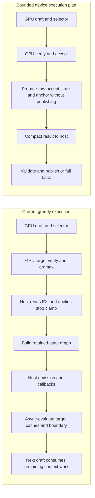

# Architectural opportunities from Splash

September 22, 2026. Scope: this M5 Max, the requested
`Qwen3.8-27B-UD-Q4_K_XL.gguf`, and the supplied BF16 DFlash2 companion.
Splash reference: `7e3c67e8e3a9e9912ff6e02521457017cc4c65d0`.
This is a source audit and reanalysis of retained measurements. It does not
introduce another runtime optimization or a new throughput result.

This report predates the implementation phase. See
[implementation results](architecture-implementation.md) for applied changes and
the [latest architectural follow-up](architecture-next.md) for the current
baseline and remaining opportunities. In particular, the duplicate 32-byte
provenance read below has since been removed; the current maximum is 60 bytes.

## Conclusion

Yes: Splash's execution architecture is useful independently of its Q4 format.
The most transferable idea is to plan the entire speculative cycle around
persistent GPU buffers, explicit dependencies, and a small result record.
That can reduce scheduling, allocation, synchronization, and intermediate
traffic while retaining our existing GGUF arithmetic.

The current evidence does not establish that these changes alone will reach
Splash's throughput. The [same-device comparison](local-device.md) measured
35.6/41.4 tokens/s for mlx-node versus 64.9/78.9 for Splash on short/6K
prompts. Both used 274 cycles on the short prompt: the main problem there is
cost per cycle, not fewer accepted proposals. Different weights and timing
boundaries remain material comparison limits.

Our earlier kernel experiments concentrated on one part of that cost. Their
failure does not reject changes to the execution architecture.

## What CPU–GPU transfer means here

Apple silicon has shared physical memory. MLX's Metal allocator explicitly
uses shared buffers; its host pointer accesses the same allocation through
`contents()`. Large weights and intermediate activations are not copied over
a discrete-GPU interconnect for each layer. Shared storage still requires
correct ordering between CPU and GPU accesses. See
[Apple's shared-storage contract](https://developer.apple.com/documentation/metal/mtlstoragemode/shared)
and [MLX's unified-memory design](https://ml-explore.github.io/mlx/build/html/usage/unified_memory.html).

There are four separate costs:

| Cost                                     | Current situation                                                                              | Architectural response                                                                      |
| ---------------------------------------- | ---------------------------------------------------------------------------------------------- | ------------------------------------------------------------------------------------------- |
| Host reads of token decisions            | Small on the measured greedy path; target argmax and draft IDs are read after evaluation       | Keep the acceptance count and next anchor on the GPU when useful; return one compact record |
| CPU waiting for GPU dependencies         | Acceptance must observe the verifier; scheduler backpressure can also wait during evaluation   | Measure actual GPU gaps and queue depth; move independent work before the boundary          |
| CPU graph traversal and command encoding | Whole-verifier compilation exists, but generic array evaluation and Metal submission still run | Introduce a bounded execution plan with persistent bindings and workspace                   |
| GPU reads/writes of intermediate tensors | Includes real prefix concatenation, conversions, projection outputs, and cache work            | Eliminate materialization and fuse only where ordering and rounding can be preserved        |

Moving more arithmetic onto the CPU is unlikely to help this serial dependency
chain without specific evidence: it adds ordering edges and competes for the
same memory system. The CPU should prepare future work and handle the API,
tokenizer, and output while the GPU runs the current cycle.

A blocked CPU is not necessarily a wasted GPU: if the GPU is doing required
verification work, removing the blocking API does not remove that computation.
The useful targets are idle gaps, redundant work, and work that can safely
overlap, measured across the whole cycle.

Sources: `crates/mlx-sys/mlx/mlx/backend/metal/allocator.cpp:17–35`,
`crates/mlx-core/src/engine/dspark_turn.rs:110–129`.

## The actual cycle, rather than the phase labels

The measured greedy, penalty-free path already keeps proposals on the GPU through target
verification. The main `argmax_arr.eval()` in acceptance realizes the lazy
dependency graph. Host acceptance then determines the retained prefix,
applies stopping rules, and constructs state commit. `eval_boundary` starts
cache evaluation asynchronously; remaining dependencies can reach the next
cycle. Reading “verify build time” therefore does not measure all CPU work,
and reading “host acceptance time” does not isolate synchronization cost.

At depth seven, at most 92 bytes of explicit token-ID data become CPU-visible:
32 bytes of target argmax IDs, 28 bytes of draft IDs, and a duplicate 32-byte
verifier-provenance copy during commit. These are shared-memory accesses and
small host copies, not 92 bytes crossing a discrete-GPU interconnect. The
waiting and dependency structure matter much more than this byte count.



Splash's unconstrained path encodes draft, verifier, sampling/acceptance,
GDN replay, and draft-context commit into one command graph. The host consumes
the completed cycle. Splash still performs host scheduling and output
handling, and its constrained-generation path has additional stages. It is
not an entirely GPU-resident server or proof that arbitrary callbacks can be
removed from our cycle.

Our stop-clamp contract is stricter than simply accepting a raw prefix:
cancellation, EOS, output/thinking budgets, repetition termination, and token
observers can shorten it before commit. A device executor must either
implement a precisely defined subset of these rules or prepare speculative
state without publishing it until the host agrees. The current path remains
the fallback for unsupported policies and shortened prefixes.

Sources: `dflash2_decode.rs:320–435`, `dspark_turn.rs:924–978`;
Splash `runtime/model/Runtime.mm:2232–2261` and its constrained decode ticket.

## New finding: avoid repeated full-prefix copies

The compiled verifier uses 16 full-attention layers, four KV heads, head
dimension 256, BF16 K/V, and eight query rows. GQA is six. To stay on the
fused vector-attention path, it splits queries into three and five rows.

Each layer builds two separate K/V concatenations:

1. Old prefix plus all eight new rows, for the tail query block.
2. Old prefix plus the first three new rows, for the head query block.

These are allocations and copies: MLX's `concatenate_gpu` allocates the output
and copies each input. They are not views. Updating a capacity-reserved live
KV cache after the compiled call does not remove these temporary copies.

Across the 16 layers, the existing prefix occupies
`16 × 4 × 256 × 2 bytes × 2 (K,V) = 65,536 bytes` per context token.
Two copies, each reading and writing that prefix, give:

| Prefix tokens | Logical prefix copy reads + writes per cycle | Ideal time at 614 GB/s |
| ------------: | -------------------------------------------: | ---------------------: |
|            87 |                                     22.81 MB |               0.037 ms |
|         6,219 |                                     1.630 GB |               2.655 ms |
|        32,768 |                                     8.590 GB |              13.990 ms |

These are source-derived tensor traffic volumes, not hardware DRAM counters
or measured savings. Caching, actual bandwidth, overlapping work, and the
replacement kernel affect latency. The prefix grows during generation.
The bandwidth is Apple's published peak for this configuration, not a
measured sustained rate. [Apple M5 Max specifications](https://www.apple.com/newsroom/2026/03/apple-debuts-m5-pro-and-m5-max-to-supercharge-the-most-demanding-pro-workflows/).

**Recommended experiment:** retain the three/five query split and existing
causal/reduction semantics, but let attention address prefix and new K/V as
two segments. A later fixed-capacity or paged BF16 cache can use the same
logical-length contract. Start with BF16; copying Splash's Q8 KV would change
numerics and is a separate experiment.

This has a clear long-context scaling benefit to investigate. It cannot
explain the short-prompt gap alone. It is also different from the rejected
2,048-token draft-attention ring experiment.

Sources: `crates/mlx-core/src/models/qwen3_5/attention.rs:612–720`,
`model/forward.rs:735–761`,
`crates/mlx-sys/mlx/mlx/backend/metal/slicing.cpp:14–42`.

## New finding: compilation does not remove execution scheduling

The verifier is already compiled once per model and verify width, with a
shape-polymorphic prefix. Recommending `compile()` as a new optimization would
miss the existing implementation. Compilation replays a fused array graph;
it does not by itself install a reusable, fully encoded Metal command buffer.
[MLX compilation documentation](https://ml-explore.github.io/mlx/build/html/usage/compile.html).

Reanalysis of one retained steady verifier segment found:

- 1,634 logged MLX primitive events, including 383 quantized matmuls.
- 80 threshold-triggered command-buffer commits and 68 finalization events.
- 67 finalizations had zero newly logged primitives; these can still contain
  synchronization/event work.

Primitive events are not dispatch counts: reshape/split can be views, while
one primitive can encode several kernels. Submissions are not host round
trips. The old phase profiler deliberately adds evaluation boundaries, so
these counts describe that diagnostic trace rather than an uninstrumented
production cycle.

The source explains why simply increasing submission sizes is incomplete:

- MLX encodes a concurrent compute pass and tracks hazards at buffer level.
- Its evaluator walks dependencies, allocates or donates storage, binds
  resources, and retains their lifetimes on each invocation.
- When more than ten tracked tasks are outstanding, or memory pressure
  requires it, evaluation finalizes open streams and waits for completion
  progress. Even asynchronous evaluation performs this host encoding work.
- The nominal memory threshold accumulates `array.data_size()` in elements,
  not a precise byte count. It should not be interpreted as actual traffic.

Backpressure can mean the CPU is already ahead of a busy GPU. Eliminating
that wait may only increase retained memory. Prior larger-command-buffer
experiments did not improve end-to-end performance. Neither fact rules out
a dedicated execution plan; both rule out claiming that fewer commits alone
must produce a large win.

Splash is also not using magic graph capture: its `CommandGraph` constructs
an ordered dispatch list and its backend loops through bindings and dispatches
for a normal compute encoder. Its advantages include fixed tensor layouts,
persistent workspace, specialized operations, and device-side cycle control.
Its execution plans become immutable after startup; the decode arena uses an
aligned shared base with lane views plus private gate scratch. Memory planning
accounts for fixed runtime allocations before assigning dynamic KV/state
capacity (`ExecutionPlans.hpp:84–123`, `RuntimeArenas.hpp:304–389`,
`engine/MemoryPlan.cpp:94–105,257–304`).

**Recommended design:** a Qwen DFlash execution-plan object, initially just
for eight-row target verification. Fix workspace addresses and ownership,
pass changing lengths/positions as runtime parameters, and reuse existing
GGUF kernels. Measure a normal encoded command list before considering ICBs
or a Metal 4 backend. An indirect command buffer can reuse encoded commands,
but stable resources, dependencies, and buffer lifetimes must come first.
[Apple indirect command buffers](https://developer.apple.com/documentation/metal/mtlindirectcommandbuffer).

Do not transplant one giant arena into MLX without adapting hazard tracking.
MLX identifies hazards by the underlying Metal buffer pointer, so independent
offset views into one allocation can become false dependencies under its
concurrent encoder. Start with separate buffers by lifetime/dependency class,
or introduce validated interval-aware tracking. A persistent arena is a
layout/ownership design, not automatically a synchronization improvement.

Sources: `model/forward.rs:534–789`, `compiled_graph.rs:1–24`;
MLX `transforms.cpp:25,270–315`, `backend/metal/device.cpp:342–352,408–435,550–671`;
Splash `runtime/metal/CommandGraph.hpp:17–79`, `MetalBackend.mm:1400–1452`.

## SIMD groups: optimize useful work, not the group count

Our eight-row `qmv_wide` already distributes K work across SIMD lanes,
decodes packed weights, and reuses them across multiple activation rows.
We also already have fused residual/RMS normalization, compatible projection
merging, compiled elementwise activation chains, and fused GDN prefix replay.

The architectural opportunities are more specific:

- Pair compatible projections and place residual/activation work in their
  epilogues, removing intermediate writes and separate dispatches.
- Handle mixed-format gate/up pairs with independent decoders when profitable,
  rather than requiring a common quantization or changing their weights.
- Preserve regular/coalesced accesses and sufficient independent work while
  limiting registers and threadgroup storage. More SIMD groups can reduce
  occupancy or duplicate work.
- Reduce vocabulary results to compact argmax/top-k outputs on the GPU where
  the API needs only those outputs. This saves logits materialization, not
  the much larger vocabulary-weight multiplication itself.

The checkpoint has 39 gate/up pairs compatible with the existing row merge
and 25 mixed-format pairs. Start a fused projection-plus-SwiGLU experiment
with the 39 compatible pairs: it can avoid about 43.45 MB of logical
intermediate writes/reads per eight-row cycle. Extending to all 64 layers
would avoid about 71.30 MB. A down-projection residual epilogue can avoid
another 10.49 MB and 64 separate adds. These are useful dispatch/fusion
targets, but their byte savings alone are small beside target weight traffic.
Pairing accumulators also increases register demand, so test the complete
dependent MLP chain before integrating either kernel.

Fusing operations must preserve intermediate BF16 rounding when claiming
exact output equivalence. For example, folding residual addition directly
into an FP32 matmul accumulator is different from adding after the current
BF16 projection result. Preserve that cast inside the fused epilogue.
Similarly, a monolithic whole-layer kernel cannot assume a cheap global
barrier between threadgroups. Retain dispatch boundaries where all-to-all
dependencies require them.

The previous SG4/SG8 and eight MPP variants already show why the number of
SIMD groups or use of matrix instructions is not an optimization by itself.
Their negative results are in [follow-up.md](follow-up.md) and
[matrix-path.md](matrix-path.md). Use representative dependent layer chains
and rotating weight working sets before full-model validation.

## State commit and memory policy

Keeping acceptance and commit together on the GPU is a useful design target,
but it must include GDN replay, convolution state, attention frontier,
target taps, draft context, and the next anchor. Moving only the mismatch
comparison saves little work and leaves most host-controlled dependencies.

GDN snapshot arrays already alias their storage. The verifier's FP32 carry
cannot replace the serial-equivalent replay state, which rounds through BF16
after each accepted token. Splash also replays the accepted recurrence.
An eight-entry serial state tape would add approximately 576 MiB of state
writes per cycle for this model, and preserving both numerical contracts
requires additional recurrence work. Retain replay; change its scheduling.

The DSpark loop also synchronizes and clears the allocator cache every 256
emitted tokens. A bounded persistent workspace and pressure-based trimming
could avoid periodic stalls and allocation churn. First measure the events;
do not remove the memory guard or assume an unbounded cache is safe.

A smaller first scheduling experiment is to submit both target-state and
draft-context settlement immediately after the host clamp, before emission
and callbacks. Currently `eval_boundary` comes after emission and explicitly
submits only target caches and the boundary token. This would preserve the
decision and arithmetic while creating an opportunity to overlap settlement
with CPU output work. Asynchronous evaluation itself can encounter scheduler
backpressure, so overlap must be measured. Retain owned roots and propagate
errors consistently on final, stopped, and continued turns.

Sources: `dflash2_decode.rs:408–435`, `layer_cache.rs:149–172`,
`dspark_turn.rs:1094–1098`; Splash `decode/gdn.metal:108–305`.

## How much could this close?

There is no demonstrated architectural ceiling at the current throughput.
There is also no measured decomposition supporting a promised 2× speedup.

Header/manifest accounting gives 16.842 GB of native target layer/head tensors
versus 14.444 GB of Splash target layer/head artifacts, a 1.166× ratio.
This excludes embeddings, vision, and the native MTP branch; Splash artifacts
include alignment. The BF16 draft file is 3.849 GB versus 1.266 GB of Splash
draft artifacts. These are stored-size comparisons, not exact bytes read per
cycle. They show a real quantization advantage, but size alone does not
explain unpacking, arithmetic, bandwidth efficiency, or the whole performance
gap.

The local Splash profiler spent about 90% of its _isolated dispatch sum_ in
matrix pipelines; the fused cycle took 52.03 ms GPU / 53.00 ms wall for that
512-token diagnostic. This is evidence about Splash's implementation, not
proof that our runtime has the same breakdown. Some of those matrix kernels
also include residual/activation epilogues.

For scale: reaching roughly 1.8–1.9× throughput at unchanged acceptance needs
roughly 45–47% less cycle time. If a measured component accounts for only
10% of cycle time, even eliminating it entirely gives at most 1.11×. We need
either a substantial scheduling/materialization cost or combined improvements
to several major costs. The old 0.28 ms “host acceptance” phase does **not**
bound all CPU–GPU synchronization savings: preceding diagnostic evaluation
already paid much of the wait. Earlier 1–3% device-commit estimates should be
treated as hypotheses, not established limits.

## Execution order and acceptance gates

1. **Obtain an unperturbed cycle timeline.** Record CPU graph/encoding spans,
   readback waits, scheduler-wait reasons, allocation/clear events, and actual
   command-buffer GPU start/end intervals. Measure the union of GPU intervals
   rather than summing potentially overlapping durations. Separate first
   compilation, steady decode, and cache-clear boundaries. The device supports
   command-buffer timings and stage sampling but not the probed legacy
   dispatch-boundary counter sampling; do not insert unsupported counter calls
   or present per-dispatch encoder splitting as normal execution.
2. **Remove verifier prefix materialization.** Prototype segmented BF16
   attention with the same three/five query partition. Validate changing
   prefix lengths, causal offsets, rejection, and continuation. Benchmark
   short/6K/16K/32K; require long-context improvement without a short regression.
3. **Prototype a persistent verifier plan and selective epilogues.** Use the
   current packed weights and vector kernels first. Compare generic MLX and
   planned execution at identical math/layout; use timeline results to decide
   whether CPU encoding, barriers, copies, or kernels deserve the next change.
4. **Extend the plan through acceptance and prepared commit.** Start greedy,
   penalty-free, one request, fixed depth. Publish only after the existing
   stop clamp agrees; discard prepared state and replay the shorter prefix
   otherwise. Then consider whether next-cycle work can safely overlap host
   emission. Do not run ahead across arbitrary observer or cancellation rules.
5. **Evaluate policy separately.** Depth selection can trade cheaper cycles
   against acceptance. It needs multiple prompts and sustained outputs; the
   prior depth-three win on one short prompt reversed at 6K. Quantized draft
   or Q8 KV changes also require separate quality/acceptance evaluation.

For runtime candidates, require kernel numerical tests and exact greedy
proposal/argmax/output/cache-state parity, then streaming/cold/cached/reset
and multi-turn continuation tests. Force every acceptance depth and every
stop boundary, including cancellation, observers, and output budgets. Check
failure atomicity and unload/reload resource lifetimes. Build the native addon
with `vp run build:native`; benchmark that artifact, not a standalone library.

Retain alternating fresh-process comparisons, output hashes, cycles, accepted
tokens per cycle, TTFT, full request time, steady GPU time, and memory peaks.
Use one GPU job at a time and retain the memory guard. A lower dispatch count
or faster isolated operator is a screening result, not the acceptance gate.

## Audit artifacts

`architecture-audit.mjs` regenerates the model-size accounting, prefix-copy
arithmetic, source hashes, and representative trace counts without loading
weights or using the GPU:

```sh
node docs/research/splash-qwen38/architecture-audit.mjs \
  .cache/benchmarks/splash-qwen38-phase3 \
  /Users/brooklyn/workspace/github/splash
```

It writes `.cache/benchmarks/splash-qwen38-phase3/architecture-audit.json`.
The focused audits are [state and cycle control](architecture-state-notes.md),
[scheduling and memory](../../../.cache/benchmarks/splash-qwen38-phase3/architecture-scheduling-notes.md),
and [kernel fusion and attention](../../../.cache/benchmarks/splash-qwen38-phase3/architecture-kernel-audit.md).
GPT 5.6 Sol subagents independently reviewed the source-level findings and
arithmetic. The audit script ran successfully; syntax, formatting, and diff
checks passed. Runtime and MLX-submodule patches remain byte-identical to the
prior validated snapshots, and both addon copies retain SHA-256
`9f1e274b9178a410bb8cc3d967d4c54b80e672bd4297d1be2c2e2bec064469f4`.
No runtime test suite was rerun for this documentation/offline-audit change. No
production code, addon, checkpoint, or default configuration changed during
this architectural research; the previously measured throughput remains the
latest verified result.
