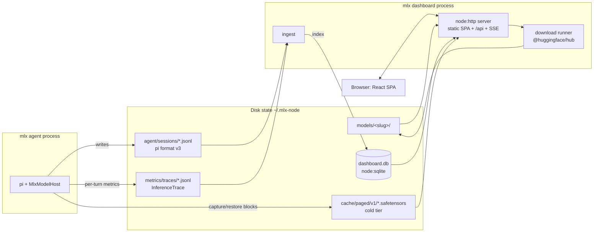

# mlx dashboard — design spec

Date: 2026-07-20
Status: approved (brainstorm complete)

## Goal

A local web dashboard, started with `mlx dashboard`, shipped inside the `@mlx-node/*` npm packages. Four feature areas:

1. Local model management + downloads from a static recommended list
2. Session history management (mlx agent / pi sessions)
3. Metrics for historical sessions
4. PagedAttention persist-cache metrics and management

## Decisions made during brainstorm

| Question | Decision |
| --- | --- |
| Persist-cache scope | Full: wire `ColdCacheManager` into inference, add NAPI stats, then dashboard UI |
| Session metrics source | Reuse `InferenceTrace` (currently opt-in, metadata-only) as the always-on metrics sink |
| UI stack | React + Vite + Tailwind CSS + shadcn/ui, SPA |
| Session management ops | Browse/inspect, delete, rename/label, resume helper; sessions indexed into local SQLite via `node:sqlite` + Drizzle ORM |
| Download source | Static recommended model list only. No search, no free-form repo input |
| Code location | New workspace `packages/dashboard`; thin `mlx dashboard` command in `packages/cli` |

## Current-state facts the design builds on

- CLI dispatch is a hand-rolled switch in `packages/cli/src/cli.ts`; each command is a lazily imported `run(argv)` module. `mlx launch claude` is the precedent for starting a local HTTP server.
- `@mlx-node/server` is plain `node:http`; no package ships static web assets today (all publish `files: ["dist"]`, tsc-only builds). UI asset shipping is net-new.
- Agent sessions are pi's append-only JSONL trees under `~/.mlx-node/agent/sessions/--<encoded-cwd>--/` (`PI_CODING_AGENT_DIR` seeded by `packages/agent/src/run-agent.ts`). pi's `SessionManager.list/listAll` returns ready-made summaries; `getBranch`/`getTree` read transcripts. Token usage persists per assistant message (`message.usage`, populated in `packages/agent/src/provider/events.ts`).
- Throughput metrics (TTFT, prefill/decode tok/s, MTP acceptance) are computed natively per turn (`PerformanceMetrics`) but never persisted — TUI footer only (`packages/agent/src/provider/performance-status.ts`). `InferenceTrace` (`packages/agent/src/provider/inference-trace.ts`) is an existing env-gated, metadata-only JSONL trace of exactly these fields.
- `ColdCacheManager` (`crates/mlx-paged-attn/src/cold_cache.rs`) is a complete SSD cold tier for immutable paged prefix blocks: `~/.mlx-node/cache/paged/v1/<sha256>.safetensors`, quota 10% of FS capped 100 GiB, LRU with mtime-rebuilt recency, checksummed atomic writes, `ColdCacheStats` counters. It is exported but instantiated nowhere; no NAPI bindings exist for its stats, `BlockAllocator` pool counts, or `PagedPrefillMemorySnapshot`.
- Model downloads use `@huggingface/hub` (`packages/cli/src/commands/download-model.ts`) with manifest-aware resume but console-only progress. Models live under `resolveModelsDir()` (`packages/cli/src/config.ts`): `-o` > `MLX_MODELS_DIR` > `~/.mlx-node/config.json` `modelsDir` > `~/.mlx-node/models`. Discovery = scan subdirs for a recognizable `config.json`. No delete, no size-on-disk, no quant surfacing in TS. Curated catalog: `packages/agent/src/catalog.ts` (`MODEL_CATALOG` / `visibleCatalog()`).

## Architecture



Principles:

- The dashboard is a **separate viewer process**. It never imports the native addon (no Metal init, instant start). All data comes from disk; live-ish behavior is polling + SSE.
- JSONL (sessions, traces) is the source of truth. SQLite is a disposable index — deleting `dashboard.db` loses nothing; it is rebuilt on next start.
- Agent-process runtime counters (cold-cache hits, throughput) reach the dashboard only via trace records; the dashboard never reads another process's memory.

## Phasing — three PRs, in order

Phase C works day one even before A/B land (token-derived metrics + disk-level cache view); richer data lights up as A/B ship.

### Phase A — cold-cache inference wiring (Rust)

- Config: `persistPagedCache` (per-model config + env override), **off by default at library level**; `mlx agent` enables it by default with a `--no-persist-cache` flag.
- Capture: when the allocator registers full blocks for cross-request reuse, `capture_and_enqueue` them to the cold tier (existing fail-open bounded queue; a full queue drops writes).
- Restore: on in-memory prefix miss, walk the `ColdCacheKey::chain` and `restore_block` before falling back to normal prefill. Any validation failure falls through silently.
- NAPI additions: `coldCacheStats()` (`ColdCacheStats` counters + root path + quota), allocator pool counts (`num_free_blocks`/`num_allocated_blocks`/`total_blocks`), and cold-tier disk info.
- Trace hook: expose per-turn cold-cache counter deltas so Phase B can persist them.
- **Open design question (resolved during Phase A planning, not here):** cold restore is only sound where paged blocks fully determine layer state. Mixed-cache families (Gemma4 sliding-window layers, LFM2 conv, Qwen3.5/3.6 GDN) need either additional state persistence or exclusion. Phase A begins with a dedicated research pass (vLLM automatic-prefix-caching prior art in `~/workspace/github/vllm`, plus our `docs/paged-cache.md` support matrix) and gates each family behind byte-parity tests, mirroring the existing paged parity-gate pattern.

### Phase B — metrics sink (agent)

- `InferenceTrace` becomes **default-on**, writing to `~/.mlx-node/metrics/traces/<date>-<pid>.jsonl`. Existing env vars stay as overrides/kill switch.
- Records gain correlation fields: pi session id + message/turn id, plus Phase A cold-cache counter deltas.
- Field set stays allowlisted and text-free (no prompt/content leakage).
- Retention: the dashboard prunes trace files older than 30 days after ingesting them.

### Phase C — dashboard package + CLI + UI

#### Package layout

```
packages/dashboard/              @mlx-node/dashboard
├── package.json                 files: ["dist", "web"]
├── src/
│   ├── server.ts                node:http; static + /api + SSE
│   ├── db/                      drizzle schema + node:sqlite driver
│   ├── ingest/                  pi JSONL + traces → sqlite
│   ├── models.ts                discover/size/quant/delete
│   ├── download.ts              @huggingface/hub runner, structured progress
│   ├── catalog.ts               installed-state overlay on agent's catalog
│   └── cache.ts                 cold-tier dir scan + mgmt
└── ui/                          Vite app (source not shipped)
    ├── vite.config.ts           build → ../web
    └── src/                     React + Tailwind + shadcn/ui

packages/cli/src/commands/dashboard.ts   thin: flags, start server, open browser
```

- `mlx dashboard [--port 6590] [--host 127.0.0.1] [--no-open] [--db <path>]`. New `case 'dashboard'` in `cli.ts` following the existing lazy-import pattern.
- UI build: `vite build` in `packages/dashboard/ui` outputs to `packages/dashboard/web/` (gitignored, built by the package `build` script so publishes include it). Uses the repo's Vite+ toolchain.
- Model detection is a small pure-TS `config.json` parser (model_type/architectures/quant/max_position_embeddings) — deliberately duplicated from `packages/lm` to avoid importing the native addon; mirrors the existing precedent in `packages/agent/src/provider/models.ts`.
- Session parsing reuses pi's `SessionManager`/`ReadonlySessionManager` (direct dependency on `@earendil-works/pi-coding-agent`, already shipped via the agent). No hand-rolled JSONL parser.
- Catalog: the static recommended list stays in `packages/agent/src/catalog.ts` (single source of truth, extended as needed). The agent package adds a `./catalog` subpath export so the dashboard imports the list without touching the agent's index (which transitively loads the native addon). `packages/dashboard/src/catalog.ts` only adds dashboard-side installed/installable state.

#### HTTP API

| Route | Method | Purpose |
| --- | --- | --- |
| `/api/models` | GET | local models: name, path, family, quant summary, size on disk, ctx window |
| `/api/models/:name` | DELETE | delete model dir (path-checked, confirmed in UI) |
| `/api/catalog` | GET | static recommended list + installed/installable state |
| `/api/downloads` | GET/POST | list active jobs / start a catalog download |
| `/api/downloads/:id/events` | GET (SSE) | per-file + byte progress, resume-aware |
| `/api/sessions` | GET | indexed session list; search + filters (cwd, model, date) |
| `/api/sessions/:id` | GET | transcript (active branch) + per-turn usage |
| `/api/sessions/:id` | PATCH/DELETE | rename (pi `session_info` entry) / delete file + rows |
| `/api/sessions/:id/metrics` | GET | joined trace metrics for the session |
| `/api/metrics/overview` | GET | aggregates: tokens/day, tok/s + TTFT trends, MTP acceptance, model share |
| `/api/cache` | GET | cold tier: entries, bytes, quota, age histogram; hit/miss trend from traces |
| `/api/cache` | DELETE | clear all, or evict older-than-N-days |
| `/api/ingest` | POST | trigger incremental rescan |

#### SQLite schema (Drizzle, `~/.mlx-node/dashboard.db`)

- `sessions`: id (pi session id), path, cwd, name, created, modified, message_count, first_message, last_ingested_mtime
- `turns`: session_id, message_id, ts, model, input_tokens, output_tokens, cached_tokens, reasoning_tokens
- `traces`: id, session_id, message_id, ts, model, ttft_ms, prefill_tps, decode_tps, mtp_mean_accepted, duration_ms, queue_ms, finish_reason, resident, cold-cache counter deltas

Ingest: full scan on start, then incremental by file mtime; manual refresh endpoint; periodic 30 s rescan while the server runs. Download job state is in-memory only (no history table).

#### UI pages

| Page | Content | Actions |
| --- | --- | --- |
| Overview | stat tiles (models/disk, sessions, tokens 7d, cache size + hit rate), recent sessions, active downloads | — |
| Models | local table: name, family, quant, size, ctx window | delete; install from recommended list w/ live progress |
| Sessions | table w/ search + filters | open, rename, delete, copy resume command (`mlx agent --session <file>`) |
| Session detail | transcript (collapsible tool calls) + per-turn tokens/tok-s chips + charts | — |
| Metrics | tokens/day (in/out/cached), tok/s + TTFT trends per model, MTP acceptance, model usage share; date range | — |
| Cache | disk usage vs quota, entry count + age histogram, hit/miss trend | clear all, evict older-than |

## Error handling & safety

- Binds `127.0.0.1` by default; loud warning for any other host. No auth; mutating routes verify `Origin`/`Host` are local to block drive-by CSRF / DNS rebinding against localhost.
- Destructive ops (delete model/session, clear cache) require UI confirmation and resolve paths strictly inside their managed roots before any `rm`.
- Fail-soft: missing dirs → empty states; malformed session file → skipped with a visible warning; missing/corrupt DB → rebuilt from JSONL.
- Downloads: resume-aware (same manifest checks as the CLI); job failures surface in the UI and are retryable; partial files are left for resume, with an explicit "remove partial" action.

## Testing

- **Phase A**: Rust unit tests for capture/restore wiring + model-gated byte-parity tests (cold restore vs fresh prefill), following `docs/paged-cache.md` parity-gate conventions.
- **Phase B**: vitest on trace record shape, correlation ids, and default-on/kill-switch behavior.
- **Phase C**: vitest for ingest (fixture JSONL → expected rows), API handlers (real server on ephemeral port, `fetch`-based), download runner with mocked hub, path-safety checks for delete routes. `vp check` + `yarn typecheck` gate the UI build. No browser-automation tests in v1.

## Out of scope (v1)

- HF search / free-form repo downloads (CLI already covers arbitrary repos)
- Live view of a running agent (no shared runtime state exists; traces are near-real-time enough)
- GPU memory telemetry in the dashboard process (would require native addon + a loaded model)
- Editing paged pool sizing (`pagedCacheMemoryMb`) from the UI — informational only
- Multi-user / remote deployment, auth
